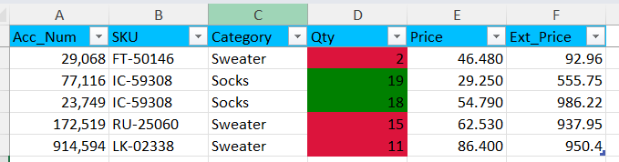

Polars allows you to save data in multiple file formats like CSV, Parquet, Avro—even Excel. What most people don't know is that you can add special formatting to the Excel file, such as setting a background color for the title cells. Yes, you can even apply conditional formatting based on a value threshold.

## Data to save

Below is a DataFrame containing the data we want to save as an Excel file.

```{python}
#|echo: false
import polars as pl

df = pl.DataFrame({'Acc_Num': [29068, 77116, 23749, 172519, 914594],
 'SKU': ['FT-50146', 'IC-59308', 'IC-59308', 'RU-25060', 'LK-02338'],
 'Category': ['Sweater', 'Socks', 'Socks', 'Sweater', 'Sweater'],
 'Qty': [2, 19, 18, 15, 11],
 'Price': [46.48, 29.25, 54.79, 62.53, 86.4]})

df
```

## Adding special formatting

Let's write code to save the data as an Excel file. We'll set the background color of the headers to blue and apply conditional formatting to the *Qty* column so that cells with a value less or equal to 15 have background color red; otherwise, they have green.

Additionally, we've frozen the headers so they remain visible when you scroll down. We've also created a new column, *Ext\_Price*, containing the formula `Qty × Price`. This formula appears in the output file just as if it had been typed directly into the Excel sheet.


```{python}
#| eval: false
(df
 .write_excel('sales.xlsx',
              formulas={'Ext_Price': '=[@Qty]*[@[Price]]'},
              freeze_panes=(1, 0),
              conditional_formats={'Qty': [
             {'type': 'cell', 'criteria': '<=', 'value': 15, 'format': {'bg_color': '#DC143C'}},
             {'type': 'cell', 'criteria': '>', 'value': 15, 'format': {'bg_color': '#008000'}}]},
              header_format={'bg_color': '#00BFFF'})
)
```

<br>

Here's what the saved and formatted Excel file looks like.

::: {.gray-text .center-text}
{fig-align="center"}
:::

Enroll in my  and join the list of satisfied students.

::: {.gray-text .center-text}
{fig-align="center"}
:::