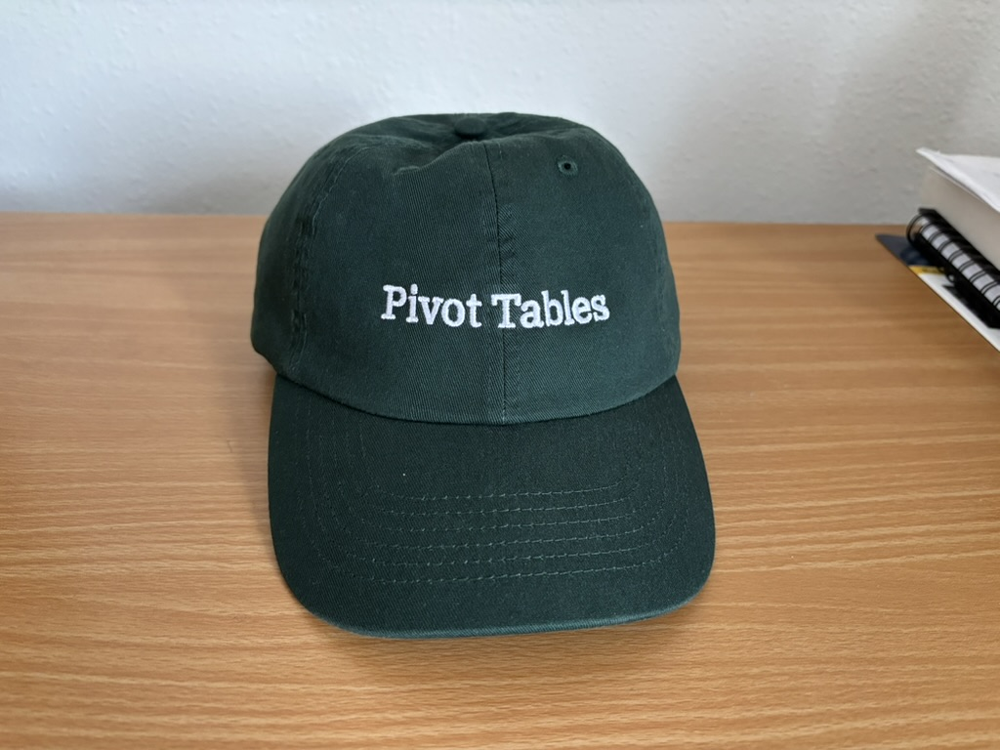

As a data professional, it's inevitable that you'll end up creating a pivot table. Stakeholders love pivot tables, and they won't pass up a chance to request one from you. It's not surprising that most people think of Microsoft Excel when they hear *PivotTable*. It turns out that Microsoft held a trademark on the term in the United States from 1994 to 2020. Today, however, the name *PivotTable* has become so generic that it no longer qualifies for trademark protection.

::: {.gray-text .center-text}
{fig-align="center"}
:::

Fortunately, pivot tables can also be created with Polars. This means you won't have to export your data to Excel and fiddle with it just to create a pivot table.

## The dataset

I'll be using sales funnel data. In business, some sales cycles are very long; for instance, those involving enterprise software or capital equipment, and management often wants to understand them in more detail throughout the year. The following are some of the questions they are likely to ask:

1. How much revenue is in the pipeline?
2. What products are in the pipeline?
3. Who has which products at what stage?
4. How likely are we to close deals by year-end?

Larger companies typically have CRM tools or other software that the sales team uses to track the sales process. Still, many people simply export the data to Excel, where they summarize it by creating a pivot table.

The benefits of creating a pivot table with Polars are:

* It's quicker once it's set up.
* It's self-documenting. You can look at the code and understand what it does.
* It's easier to generate multiple reports.
* It offers the flexibility to define custom aggregation functions.

Let's read in the data.

```{python}
import polars as pl
pl.Config(set_tbl_rows=20)

df = pl.read_excel('https://pbpython.com/extras/sales-funnel.xlsx')
df
```

## Creating pivot tables

The `pivot` method is used to create a pivot table in Polars. However, not all data outputs that look like pivot tables are created with `pivot`. Sometimes, `group_by` does the trick.

Suppose we wanted to find the average (mean) *Account*, *Price*, and *Quantity* for each *Name*. We can do so using `group_by`.

```{python}
(df
 .group_by('Name')
 .agg(pl.mean('Account','Price','Quantity'))
 )
```

In this case, the values in *Name* are unique keys that appear only once. If the original dataframe contained one name appearing two or more times, Polars would calculate the average of its values and display the company name only once in the final output. This is exactly what `group_by` does.

We can also `group_by` multiple columns.

```{python}
(df
 .group_by('Name','Rep','Manager')
 .agg(pl.mean('Account','Price','Quantity'))
 )
```

Of course, this is not a particularly useful output. A better result is one that shows a combination of manager and representative as the key values.

```{python}
(df
 .group_by('Manager','Rep')
 .agg(pl.mean('Account','Price','Quantity'))
 )
```

The output above shows that Fred Anderson has two representatives, while Debra Henley has three.

We can also perform an aggregation on a single column. The *Account* and *Quantity* columns aren't providing useful values here, so I'll exclude them.

```{python}
(df
 .group_by('Manager','Rep')
 .agg(pl.mean('Price'))
 )
```

We can also use an aggregation other than `mean`.

```{python}
(df
 .group_by('Manager','Rep')
 .agg(pl.sum('Price'))
 )
```

Or even use multiple aggregation functions.

```{python}
(df
 .group_by('Manager','Rep')
 .agg(pl.mean('Price').name.prefix('Avg_'), # <1>
      pl.count('Price').name.prefix('Count_'))
 )
```

1. Since different aggregations are used on the same column *Price*, we must ensure that the final columns have different names, otherwise the code breaks. Polars dataframes can't have multiple columns with the same name.

Sometimes, we may want to see sales broken down by product. This is where `pivot` comes in. The values contained in the column specified by the `on` parameter become new columns in the final output.

```{python}
(df
 .pivot(index=['Manager','Rep'],
        on='Product', values='Price',
        aggregate_function='sum')
 )
```

We can also use multiple columns in the `values` parameter.

```{python}
(df
 .pivot(index=['Manager','Rep'],
        on='Product', values=['Price','Quantity'],
        aggregate_function='sum')
 )
```

A rule of thumb I follow is that whenever you want the values in a column to become new columns in the final output, use `pivot`; otherwise, use `group_by`. So, if we want *Product* to be part of the index and don't need a column for the `on` parameter, then we'll have to use `group_by`.

```{python}
(df
 .group_by('Manager','Rep','Product')
 .agg(pl.sum('Price','Quantity'))
 .sort('Manager','Rep','Product')
 )
```

This output makes much more sense, at least for this dataset. Now, what if we want to include a grand total row at the bottom of the dataframe, much like you would see in an Excel pivot table? In pandas, this is easy to achieve. The `pivot_table` function has a `margins=True` parameter that adds a grand total row.

By contrast, Polars does not have a `margins=True` parameter in its `pivot` method. However, the versatility of Polars makes it possible to create a grand total row yourself.

```{python}
(df
 .group_by('Manager','Rep','Product')
 .agg(pl.sum('Price','Quantity').name.prefix('Sum_'),
      pl.mean('Price','Quantity').name.prefix('Avg_'))
 .sort('Manager','Rep','Product')
 .pipe(lambda _df: _df.vstack(
       _df.select(Manager=pl.lit('All'),
                  Rep=pl.lit(None, dtype=pl.String),
                  Product=pl.lit(None, dtype=pl.String),
                  Sum_Price=pl.sum('Sum_Price'),
                  Sum_Quantity=pl.sum('Sum_Quantity'),
                  Avg_Price=pl.mean('Avg_Price'),
                  Avg_Quantity=pl.mean('Avg_Quantity'),
                  )))
)
```

Let's look at the sales funnel at the manager level. At the moment, the *Status* column has the string data type. We'll convert it to the enum data type and define the hierarchy in the order we want.

```{python}
(df
 .with_columns(pl.col('Status').cast(pl.Enum(['won','pending','presented','declined'])))
 .group_by('Manager','Status')
 .agg(pl.sum('Price'))
 .sort('Manager','Status', descending=[False,True]) # <1>
 .pipe(lambda _df: _df.vstack(
     _df.select(Manager=pl.lit('All'),
                Status=pl.lit(None),
                Price=pl.sum('Price'),
                )))
 )
```

1. Notice how values in *Status* follow the order set in the enum, although this time in reverse since `descending=True`.

So far, we've used `group_by` and `pivot` separately. Once again, unlike pandas, where you can pass different aggregation functions for a single column or multiple columns in one pivot table call, Polars allows only one aggregation function at a time. However, the same result can be achieved by combining the `group_by` and `pivot` methods.

```{python}
(df
 .group_by('Manager', 'Status', 'Product')
 .agg(Quantity=pl.len(),
      Price=pl.sum('Price'))
 .pivot(index=['Manager','Status'], on='Product',
        values=['Quantity','Price'], sort_columns=True)
 .sort('Manager','Status')
 .fill_null(0)
)
```

::: {.callout-note}
The aggregation functions used are `len` for *Quantity* and `sum` for *Price*.
:::

We can also perform more than two aggregations.

```{python}
df_pivot_table = (df
 .group_by('Manager', 'Status', 'Product')
 .agg(Quantity=pl.len(),
      Sum_Price=pl.sum('Price'), # <1>
      Avg_Price=pl.mean('Price'))
 .pivot(index=['Manager','Status'], on='Product',
        values=['Quantity','Sum_Price','Avg_Price'], sort_columns=True)
 .sort('Manager','Status')
 .fill_null(0)
)
df_pivot_table
```

1. Another way of renaming instead of using `name.prefix` to ensure multiple columns don't have the same name.

## Advanced pivot table filtering

Interestingly, we can perform filter operations on *df_pivot_table* because, despite being a pivot table, it's still a regular dataframe.

Let's filter the rows for a single manager, Debra Henley.

```{python}
(df_pivot_table
 .filter(Manager='Debra Henley')
 )
```

Or we can look at the pending and won deals.

```{python}
(df_pivot_table
 .filter(pl.col('Status').is_in(['pending','won']))
 )
```

Pivot tables are too useful and too powerful to remain the preserve of Microsoft Excel alone. They can be created with many data analysis tools, including Polars, pandas, and DuckDB.

Check out my Polars book to learn more about this powerful data analysis tool.

- 
- 
