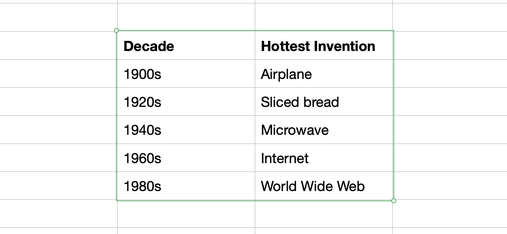

As a data professional, you'll work with many Excel files, and most of them will be poorly formatted. This makes it difficult to read the file into a dataframe. Fortunately, there's a way to copy only the rows and columns you want and turn them into a dataframe. You can run Polars code that instantly creates a dataframe from the contents of your clipboard. Below is a table copied from an Excel file.

::: {.gray-text .center-text}
{fig-align="center"}
:::

## Paste to dataframe

To paste the table from your clipboard into a dataframe, use the expression `pl.read_clipboard`. It works like magic. Here's how to do it:

```python
import polars as pl

df = pl.read_clipboard()
df
```

```{python}
#| echo: false
import polars as pl
df = pl.DataFrame({
    "Decade": ["1900s", "1920s", "1940s", "1960s", "1980s"],
    "Hottest Invention": ["Airplane", "Sliced bread", "Microwave", "Internet", "World Wide Web"]
})

df
```
<br>
And voilà! You have your dataframe.

Join 100+ students in the !