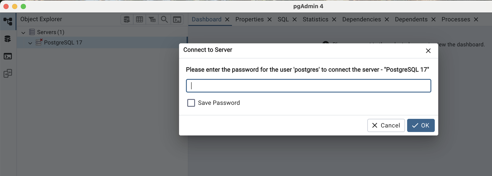
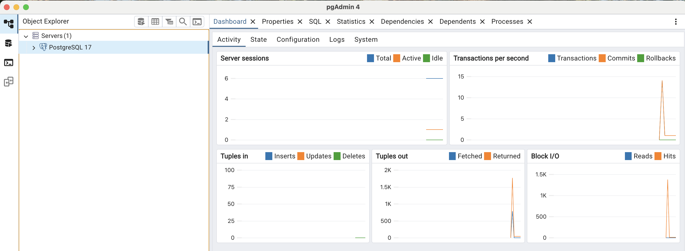
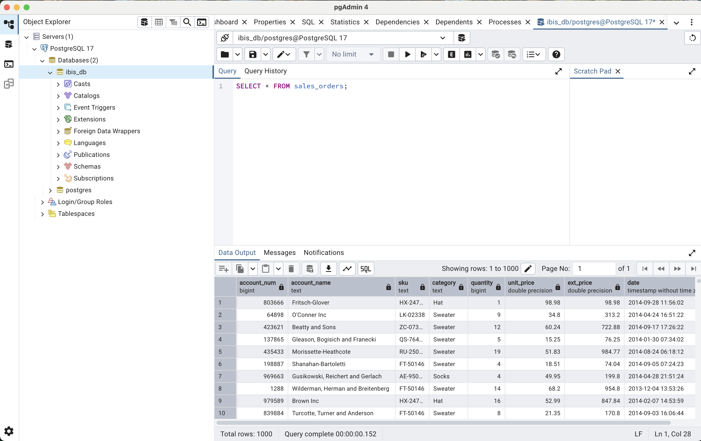
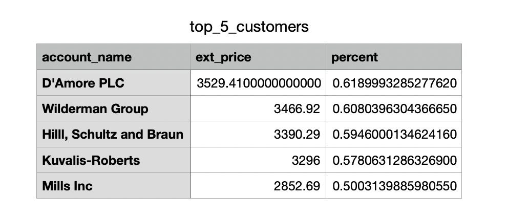

If you started working in the data field 20 years ago, you probably used a lot of SQL. It’s a robust, 50-year-old technology that excels at querying data, thanks to decades of research and development in database engines.

But if you're working in data analyst or scientist today, you're likely more familiar with dataframe APIs like Pandas, Polars, or PySpark. Dataframe libraries have become the standard in data science and analytics. In fact, more data professionals today know how to use a dataframe library like Pandas than SQL. Currently, Pandas is the most widely adopted, but recently Polars has become so good it can't be ignored.

Like many people, I find dataframe libraries easier and more intuitive to work with than traditional SQL. Their syntax often feels more flexible and expressive, especially when working in Python-centric environments.

## Downsides of dataframe libraries

While dataframe libraries like Pandas are convenient and user-friendly, they often lack the kind of optimized query engines that databases provide. SQL continues to shine when it comes to performance, particularly for operations like `GROUP BY` aggregations. Even Wes McKinney, the creator of Pandas, has acknowledged that complex aggregation operations in Pandas can be "awkward and slow."

Another downside is that writing new rows of data to a dataframe can be tedious and computationally expensive. This is largely because most dataframe libraries are columnar in design, whereas traditional database tables are row-oriented and optimized for such operations.

## Combining database and dataframe APIs

What if we could combine the elegance of dataframe syntax with the efficiency of database engines? That would allow us to write powerful queries in a syntax that's accessible to both SQL pros and their colleagues who may not be familiar with SQL, while still leveraging the power of a backend database engine to perform query optimizations.

If only there were a project that brought together the best of both worlds. Well, there is--and it’s called **Ibis**. It's like a match made in heaven!

## What is Ibis?

Ibis is a Python library that provides a high-level, dataframe-like interface for working with structured data across different backends, such as SQL databases, big data engines like Apache Spark, and in-memory dataframes like Pandas or Polars. It allows users to write expressive and chainable code for data manipulation and analysis without worrying about the backend engine processing the data. This means you can efficiently run your queries with the same syntax on different systems.

If you’ve worked with different SQL databases, you’ve likely noticed that each one can have its own SQL dialect. This can make it hard to scale your workflow from local development to large production environments. Ibis solves this problem by letting you use the same code across multiple databases.

Wes McKinney created Ibis, which makes me trust that it's a great project. Why? Because he learned from the mistakes of Pandas which he outlined in his [10 Things I Hate About pandas](https://wesmckinney.com/blog/apache-arrow-pandas-internals/) blog post, and he's correcting those mistakes with Ibis.

## Business reasons to use Ibis

You may be asking, "Why should my business switch to Ibis?" Beyond being a cool piece of technology, there are solid business reasons to adopt Ibis in your company. Here are two good reasons.

1. **It acts as an insurance policy** - If your core vendor changes their policy or switches to a different database, you won’t need to rewrite your code. Just update the backend, and your existing code will continue to run smoothly. This can save you tens--or even hundreds--of developer hours.
1. **It prevents vendor lock-in** - At some point, you’ll probably want to move your data out of a vendor system and use it elsewhere—like in a browser for visualization or in a dashboard. With Ibis, you don’t need to write custom code for each database. The same Ibis code works whether you're using Microsoft SQL Server, MySQL, or another system. Once again, this saves your company time and money.

## Setting up Ibis

We’ve talked about how great Ibis is, but how do you actually use it to answer questions about your data? I’ll walk you through setting up the database, loading the data, and finally analyzing it. You’ll see just how easy it is to answer business questions using Ibis queries.

### Installing the database

For this walkthrough, we’re going to [download PostgreSQL](https://www.postgresql.org/download/) and install it on our machine. I recommend using the same database to make it easier to follow along.

::: {.callout-tip title="Remember!"}
Keep the server password you create when installing the PostgreSQL database. You’ll need it later when connecting Ibis to the database.
:::

Once you’ve installed PostgreSQL, it will also install another piece of software called `pgAdmin`. This is a graphical interface that lets you interact with the database. Here’s what you’ll see when you open `pgAdmin` for the first time.

::: {.gray-text .center-text}
{fig-align="center"}
:::

After entering the password you created, you should see this.

::: {.gray-text .center-text}
{fig-align="center"}
:::

Congratulations! You’ve successfully installed PostgreSQL.

### Creating a database

Now that PostgreSQL is up and running, let’s create a database called `ibis_db`. This is where we’ll store the data we’ll be analyzing. On the top left, click the database with left arrow icon or simply press `OPTION + SHIFT + Q` in `pgAdmin` to open the Query tab. Then paste the code below, then execute it by pressing `F5` to create the database.

```sql
CREATE DATABASE ibis_db;
```

### Creating a table

We now have the database set up. Next, we need to create a table in `ibis_db` to store the data we’ll be analyzing.

Shut down `pgAdmin`, then open it again. Click the drop-down arrow next to **Databases** and select `ibis_db` by clicking on it. Open a new query tab and paste the code below. This is the schema that will create a table called *sales_orders*.

```sql
CREATE TABLE Sales_Orders (
    Account_Num   BIGINT,
    Account_Name  TEXT,
    Sku           TEXT,
    Category      TEXT,
    Quantity      BIGINT,
    Unit_Price    DOUBLE PRECISION,
    Ext_Price     DOUBLE PRECISION,
    Date          TIMESTAMP
);
```

To check if the table has been created, erase the code you used to create the table and type the following code.

```sql
SELECT * FROM sales_orders;
```

This will display the table with all the 8 columns, but with no data. Remember we haven't loaded the data yet.

### Getting the data

We'll use a dataset from a clothing store, which you can [download here](https://github.com/jorammutenge/learn-rust/blob/main/sample_sales.csv). The dataset contains clothing sales data over two years. It has 8 columns and 1,000 rows. You'll notice that it's a CSV file once you download it. I like this dataset because it's rich enough to help us explore the capabilities of Ibis.

### Loading data to database

We've downloaded the CSV file. Next, we need to load the data into the *sales_orders* table.

In `pgAdmin`, make sure you've selected `ibis_db` as the database. Then click the `PSQL Tool` icon (the rightmost icon on the first panel). This will open a query tab that looks like the terminal or command line. Now paste the code below into that terminal and press Enter. This should load all the data into the *sales_orders* table.

```sql
\copy Sales_Orders FROM 'full/path/sample_sales.csv' WITH (FORMAT csv, HEADER true)
```

::: {.callout-note}
Make sure you enter the full path to where the downloaded CSV file is saved.
:::

Now check if the data has been loaded by typing this query in the normal query tab:

```sql
SELECT * FROM sales_orders;
```

This should display the table with all the data. Here's what a successful result should look like.

::: {.gray-text .center-text}
{fig-align="center"}
:::

### Connecting Ibis to the database

To connect Ibis to our PostgreSQL database, we need to install some Python libraries. Run the following commands in your command line or terminal.

```bash
pip install ibis
pip install 'ibis-framework[postgres]'
```

::: {.callout-note}
We're installing `ibis-framework[postgres]` because our data is stored in a PostgreSQL database. If our data were stored in a MySQL database, we would have installed `ibis-framework[mysql]`.
:::

```python
import ibis
from ibis import _ # the underscore is a short way to access columns

# Credentials
user = 'postgres'
password = 'your_server_password_created_earlier'
host = 'localhost'
database = 'ibis_db'

# Create the connection string
connection_string = f"{user}://{user}:{password}@{host}:5432/{database}"

# Connect to the database
con = ibis.connect(connection_string)

# Access a table
t = con.table('sales_orders')

# Display the table
t
```

```{python}
#| echo: false

from dotenv import load_dotenv
import os
import ibis
from ibis import _
ibis.options.interactive = True

# Load environment variables
load_dotenv()

# Retrieve credentials
user = os.getenv("DB_USER_P")
password = os.getenv("DB_PASSWORD")
host = os.getenv("DB_HOST")
database = os.getenv("DB_NAME_P")

# Create the connection string
connection_string = f"{user}://{user}:{password}@{host}:5432/{database}"

# Connect to the database
con = ibis.connect(connection_string)

# Access a table
t = con.table("sales_orders")
t
```

Great! Now we can view the *sales_table* outside `pgAdmin`. This means the setup is complete.

While we're at it, let's verify the backend that our queries will be using.

```{python}
t.get_backend()
```

## Analyzing data with Ibis

We can now begin answering business questions using our dataset. It's important to note that while we write our queries using Ibis in a dataframe-like syntax, the actual data processing is handled by PostgreSQL. We're leveraging the power of PostgreSQL's query engine to perform the computations.

### Table transformation

The table displayed above shows the *date* as the last column. I prefer to have the date as the first column in my datasets. Let's make that change.

```{python}
t = t.relocate('date')
t
```

### Aggregations and sorting

Let's determine which clothing category generates the most revenue, and then rank all the clothing categories in descending order based on their total revenue.

```{python}
(t
 .aggregate(by='category', ext_price=_.ext_price.sum())
 .order_by(ibis.desc('ext_price'))
 )
```

The query above works, but I don't like the style of the code. We can rewrite it in more idiomatic way (ibisic) as follows.

```{python}
(t
 .group_by('category')
 .agg(ext_price=_.ext_price.sum())
 .order_by(_.ext_price.desc())
 )
```

What if we wanted to know what the top-selling SKUs are by quantity and revenue and then sort the values by quantity in ascending order.

```{python}
(t
 .group_by('sku')
 .agg(quantity=_.quantity.sum(),
      ext_price=_.ext_price.sum())
 .order_by(_.quantity.asc())
 )
```

Just for fun, let's perform multiple aggregates in a single query. We'll calculate the total, average, and median sales value for each day of the week, then sort the results by average sales.

This query includes creating a new column called *day* based on the *date* column.

```{python}
(t
 .mutate(day=_.date.day_of_week.full_name())
 .group_by('day')
 .agg(total_sales=_.ext_price.sum(),
      avg_sales=_.ext_price.mean(),
      median_sales=_.ext_price.median(),)
 .order_by(_.avg_sales.desc())
 )
```

### Filtering and creating columns

We want to know which year had the highest revenue and what was the dollar value of that revenue. Here's the query to do just that.

```{python}
(t
 .mutate(year=_.date.year())
 .group_by('year')
 .agg(total_sales=_.ext_price.sum())
 .filter(_.total_sales == _.total_sales.max())
 )
```

Suppose we want to identify the hours of the day with the least store traffic so we can reduce the number of employees during those times. After all, we don't want them standing around with nothing to do! To achieve this, we'll select the top three hours of the day with the lowest sales.

```{python}
(t
 .mutate(hour=_.date.hour())
 .group_by('hour')
 .agg(total_sales=_.ext_price.sum())
 .order_by(_.total_sales.asc())
 .limit(3)
 )
```

It's winter, and we'd like to identify all customers who purchased either socks or a sweater. We plan to send them an email about our new holiday-themed socks and sweaters now in stock.

```{python}
(t
 .select('account_name', 'category')
 .filter(_.category.isin(['Sweater', 'Socks']))
 .select('account_name')
 .distinct()
)
```

Next, let’s find customers who bought **both** socks and sweaters. These loyal shoppers will receive a special 5% discount as a thank-you for their continued support.

```{python}
(t
 .filter(_.category.isin(['Sweater', 'Socks']))
 .group_by('account_name')
 .having(_.category.nunique() == 2)
 .select('account_name')
)
```

### Graph plotting

Yes, Ibis supports native plotting using the Altair visualization library. You can install it by running `pip install altair` in your command line or terminal.

Other popular visualization libraries like Plotly, Matplotlib, or Seaborn can also be used. However, you'll need to convert your Ibis tables to Pandas using the `.to_pandas()` function before using them with these libraries.

Let's create a bar chart that displays the total quantity sold for each product SKU to identify which SKU has the highest sales by quantity. More importantly, we'll arrange the bars from tallest to shortest. We'll use Altair to build the chart.

```{python}
import altair as alt

bar_chart = (alt
 .Chart(t.group_by('sku').agg(total_quantity=_.quantity.sum()))
 .mark_bar(color='#556B2F')
 .encode(x=alt.X('sku', axis=alt.Axis(labelAngle=0, labelFontSize=14), title=None,
                 sort=alt.EncodingSortField(field='total_quantity', order='descending')),
         y=alt.Y('total_quantity', axis=alt.Axis(labelFontSize=14), title=None),
         tooltip=['sku','total_quantity'])
 .properties(width=1000, height=500, 
             title={'text':'Total quantity by product SKU', 'fontSize': 20})
#  .configure_view(fill='#FFE4B5')
 .configure(background='#FFE4B5')
 .interactive()
 )
bar_chart.show()
```

### Pivot tables

If you typically do your data analysis in Excel, then pivot tables are likely your go-to tool. Fortunately, Ibis also supports pivot table transformations, so you won't need to switch back to Excel.

Let's create a pivot table that shows the total quantity for each month in 2014. The months will be the columns, with the total quantity values displayed in the corresponding column for each month.

```{python}
(t
 .filter(t.date.year() == 2014)
 .mutate(month=t.date.strftime('%b-%Y'))
 .select('quantity','month')
 .pivot_wider(names_from='month', values_from='quantity', names_sort=True, values_agg='sum')
)
```

There’s an issue with the result of the query above. It's not with the values themselves, but with how the columns are arranged. The months aren’t in the correct calendar order. Let’s fix that!

It turns out this is a bit more complicated than expected. Here's the initial code I wrote, thinking it would fix the issue—but it didn't. Since *month_num* contains values like 1 for January, 2 for February, and so on, I assumed that sorting by *month_num* in ascending order (1, 2, 3, etc.) would produce the correct calendar order. However, the pivot table doesn't preserve that order.

```python
(t
 .filter(t.date.year() == 2014)
 .mutate(month=t.date.strftime('%b-%Y'),
         month_num=_.date.month())
 .order_by('month_num')
 .select('quantity','month')
 .pivot_wider(names_from='month', values_from='quantity', names_sort=True, values_agg='sum')
)
```

Here’s the solution that actually works. First, we need to create a sorted Python list of months. To do that, we'll convert our Ibis table to a Polars dataframe and extract the list from there.

```{python}
month_list = (t
 .filter(t.date.year() == 2014)
 .mutate(month_num=_.date.month(),
         month=_.date.strftime('%b-%Y'))
 .select('month','month_num')
 .order_by('month_num')
 .distinct(on=['month', 'month_num'])
 .to_polars()
 ['month'].to_list()
 )
month_list
```

Now we can use `month_list` in the Ibis code to generate a pivot table with the correct month ordering, starting with Jan-2014.

```{python}
(t
 .filter(t.date.year() == 2014)
 .mutate(month=t.date.strftime('%b-%Y'))
 .select('quantity','month')
 .pivot_wider(names_from='month',values_from='quantity', values_agg='sum')
 .relocate(*[month_list])
)
```


### Customer segmentation

We want to offer a discount to our loyal customers, which we define as any customer who has purchased clothing from every product category available in our store.

First, let's take a look at all the product categories we have in stock.

```{python}
(t
 .select('category')
 .distinct()
 )
```

Since we know there are three product categories in stock, we can easily write a query to retrieve the list of loyal customers as follows:

```{python}
(t
 .group_by('account_name')
 .aggregate(category_num=t.category.nunique())
 .filter(_.category_num == 3)
)
```

In most cases, we won’t know in advance how many product categories are available. That means the previous query wouldn’t be suitable. Here’s the revised version of the query for situations where the number of product categories is unknown.

And since we're only interested in the customers, we'll remove *category_num* from the table.

```{python}
(t
 .group_by('account_name')
 .aggregate(category_num=t.category.nunique())
 .filter(_.category_num == t.select(t.category).distinct().count())
 .select('account_name')
)
```

To get the total number of loyal customers, we just need to add one line to the query.

```{python}
(t
 .group_by('account_name')
 .aggregate(category_num=t.category.nunique())
 .filter(_.category_num == t.select(t.category).distinct().count())
 .count()
)
```

Now we’ve identified the 11 individual loyal customers eligible for the 10% discount. They’ll be thrilled to receive this discount--and maybe even encouraged to make more purchases from our store.

Next, let’s identify the top five customers who contribute the highest percentage of revenue to our business.

```{python}
(t
 .group_by('account_name')
 .agg(ext_price=_.ext_price.sum())
 .mutate(percent=(_.ext_price / _.ext_price.sum()) * 100)
 .order_by(_.percent.desc())
 .head(5)
#  .limit(5)
 )
```

The low revenue percentages from these top five customers suggest that our business is well-diversified. Losing any single customer would not have a major impact on our overall performance.

### Saving data

Let’s save the data for the top 5 customers in a CSV file, which we can share with the clothing store’s shareholders. Ibis makes it easy to export data in multiple formats, including CSV, JSON, Excel, Parquet, and more.

```python
(t
 .group_by('account_name')
 .agg(ext_price=_.ext_price.sum())
 .mutate(percent=(_.ext_price / _.ext_price.sum()) * 100)
 .order_by(_.percent.desc())
 .head(5)
 .to_csv('top_5_customers.csv')
 )
```

Here's the opened CSV file saved to my disk.

::: {.gray-text .center-text}
{fig-align="center"}
:::

## Conclusion

We've only scratched the surface of what Ibis can do. Hopefully, I've whetted your appetite to give this powerful library a try because after using it, I think I’ve found the answer to the question I posed in the title. Maybe data people are not talking about Ibis because they're keeping it a secret. They want to be the only ones benefiting from it.

Well, the ibis is out of the nest now, and it’s taking flight. Let’s spread the word and let it soar across the data landscape. And to all the data podcasts out there, I'd be thrilled to be a guest on your show to talk about this unsung hero of a Python library in the data field. Do reach out!

