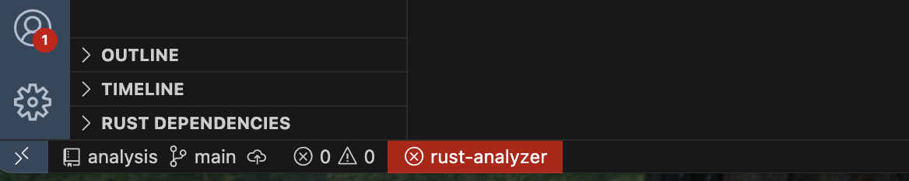
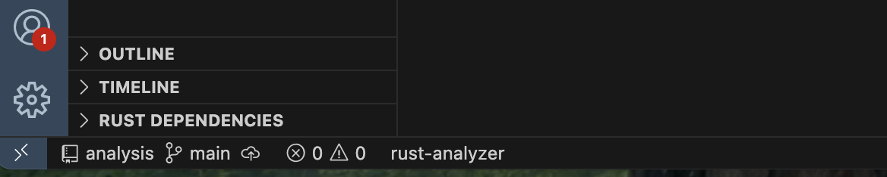

Rust is hot right now. Everyone wants to learn it, or at least that’s what they say. I’m in love with the language too, and recently I convinced myself that it would be a good idea to become a master at Rust. So I did the thing that always works whenever you’re trying to learn something technical: putting in keyboard time. You literally have to put your fingers on the keyboard and press the damn keys.

With Python being my first programming language, I knew learning Rust was not going to be a walk in the park. So I had to arm myself with anything that would make it easier to learn. A few searches for “How can I make learning Rust easier?” pointed me to the VSCode extension **Rust Analyzer**. I installed the extension, and it worked -- until it didn’t.

## The dreaded red highlight and x mark

You know Rust Analyzer isn’t working anymore when it shows up like this in your text editor:

::: {.gray-text .center-text}
{fig-align="center"}
:::

It turns out Rust Analyzer only works when the folders in your working directory are Rust projects. If any of your folders aren’t Rust projects, you’ll get the dreaded red highlight, and Rust Analyzer will fail.

## How to solve the failure

Suppose you have a *Parent-folder* with subfolders *Project-1* and *Project-2*. To make Rust Analyzer work, you’ll need to create a `Cargo.toml` file in *Parent-folder* and list the subfolders. First, the hierarchy of your folders should look like this:

```markdown
Parent-folder
├── Project-1
│   ├── src
│   │   └── main.rs
│   └── Cargo.toml
├── Project-2
│   ├── src
│   │   └── main.rs
│   └── Cargo.toml
└── Cargo.toml   <-- workspace file
```

And here’s what the `Cargo.toml` in *Parent-folder* should look like:

```toml
[workspace]
members = [
    "Project-1",
    "Project-2"
]
```

When you save the `Cargo.toml` file, the Rust Analyzer status in your text editor will look like this:

::: {.gray-text .center-text}
{fig-align="center"}
:::

This indicates that Rust Analyzer is now working properly.
