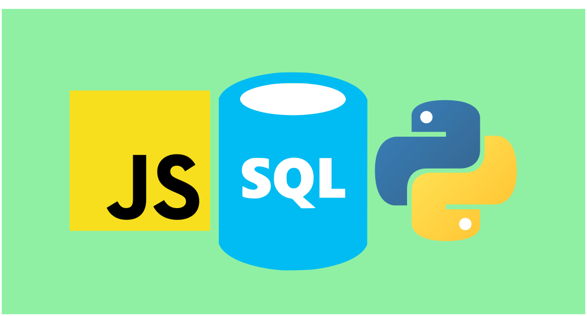

::: {.gray-text .center-text}
{fig-align="center"}
:::

The data field is becoming increasingly competitive because many people are switching careers to join it. Back in the day, you only needed to know one language, like SQL or R, to land a job, provided you could analyze data, uncover insights, and create reports that drive business value. That is no longer the case. To stand a good chance of being hired in the data profession, you must be what I call a **triple threat data professional**.

## What it takes to be a triple threat

You need to learn three programming languages to be a triple threat data professional. These languages are SQL, Python, and JavaScript. You probably already know that SQL and Python are essential for functioning effectively as a data professional. But knowing only these two languages makes you a good data professional, not a triple threat. To reach that level, you must add another language: JavaScript.

## Why learn these 3 languages?

### SQL

Most companies store their data in databases, and SQL is the de facto language used to retrieve that data. To perform analysis, you must understand how the tables in the database relate to each other and what SQL statements you can write to extract the information.

Obviously, you’re not going to pull all the data, especially if the database contains over 20 tables, each with millions of rows. You must be a data professional who is comfortable [thinking in tables](https://www.conterval.com/blog/thinking-in-tables/index.html){target="_blank"}. You need to know which joins to use, how to pull only the necessary data, and how to structure queries so they run efficiently. If your data is in the cloud, slow queries can also cost the company money.

### Python

Right now, Python is the most popular programming language in the world, and the majority of people who use it are not software engineers but rather data analysts and data scientists. Python makes it easy to clean and manipulate data. Once you’ve retrieved data from the database, you can clean and transform it into any format convenient for reporting.

You’ve probably heard that 80% (or more) of data work involves cleaning. In my experience, it’s far easier to clean data using Python than SQL. Python has rich libraries that simplify data cleaning and manipulation, such as pandas or my favorite, [Polars](https://www.udemy.com/course/analyzing-data-with-polars-in-python){target="_blank"}. These libraries can transform data cleaning from a chore into something that feels more like play.

Another advantage of Python is its abundance of machine learning libraries. Yes, you can compute simple statistics in SQL, such as min, max, average, and standard deviation. But if you want to build machine learning models that involve complex matrix calculations, Python is the language of choice. Imagine implementing XGBoost in SQL, it would be painful. In Python, you can do it in fewer than five lines of code.

Python also has data visualization libraries, but most focus on static visualizations. These libraries are great when you want to create plots for print (books, magazines, etc.). However, if you want full interactivity in your charts, you’ll need JavaScript.

### JavaScript

JavaScript may feel like an odd language for a data professional to learn, but if you want to create fully interactive charts, you need it. Most Python visualization libraries that offer partial interactivity rely on JavaScript under the hood. To unlock full interactivity, you must learn how to build plots directly with JavaScript.

Many JavaScript visualization libraries are optimized for interactivity. Popular ones include:

* [D3](https://d3js.org/)
* [Three.js](https://threejs.org/)
* [Apache ECharts](https://echarts.apache.org/en/index.html)

## Final thoughts

Realizing you need to learn three languages to boost your chances of being hired in today’s data field can feel daunting. But once you learn one language, picking up a second or third becomes easier. I started with Python, then moved on to SQL, and now I’m learning JavaScript. I accelerated my SQL learning by translating my Polars code into SQL. I would analyze a dataset in Python with Polars and then rewrite the same logic in SQL to check if I got the same results. This helped me see the similarities between Polars and SQL and strengthened my understanding of SQL.

Although JavaScript and Python have different syntax, they share core concepts such as functions, scope, loops, and variables. That’s why my journey with JavaScript has not been as tough as when I was first learning Python. Make time to learn at least the basics of all three languages, and before you know it, you’ll be a **triple threat data professional**.
