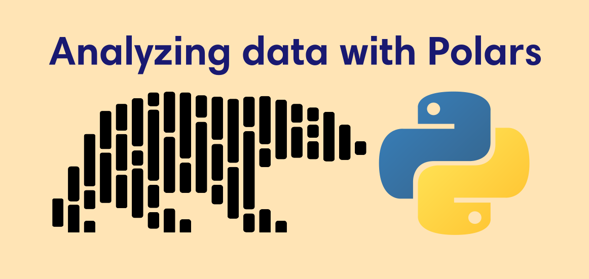
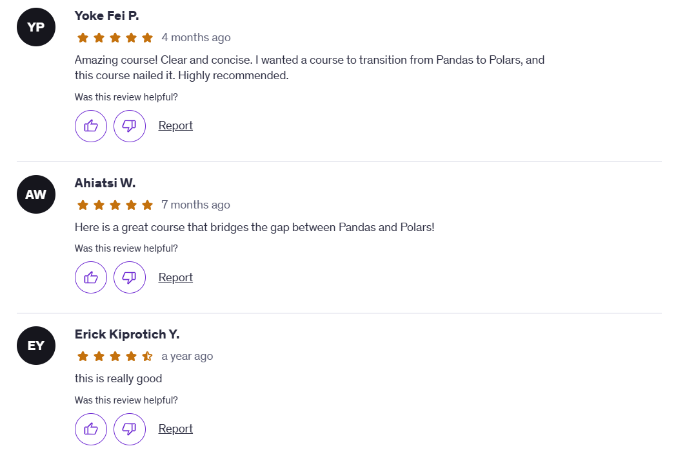

::: {.gray-text .center-text}
{fig-align="left"}
:::

In October 2023, I published a comprehensive course on Udemy about using the Polars library. Polars is a Python library for analyzing data, and I’m convinced it will soon replace pandas. Why? Because it processes data faster and has an easy-to-use syntax.

My course isn’t as popular as Angela Yu’s *100 Days of Python* yet, but at the very least the revenue it generates is enough to let me eat out and enjoy a nice meal once a month.

Since then, the adoption of Polars has grown and the library has seen significant improvements. That’s why, over the past month, I’ve been working on upgrading my Polars course. I’m happy to announce that the updated version is now live. It’s a complete overhaul of the entire course, with new videos built using the latest version of Polars.

## What's new in the course?

### Data visualization section

The biggest update I made to the course is the addition of a data visualization section. When I first published the course, Polars did not support native plotting. You had to convert your Polars dataframe to pandas dataframe before creating charts. That’s no longer the case. You can now create charts natively using visualization libraries like Altair, Plotly, and hvPlot (which I use in the course).

### Practical datasets

I also replaced some datasets with more practical ones to make the lessons immediately applicable for students. On top of that, I removed deprecated functions from the code that no longer work in the latest version of Polars.

### Improved understanding of material

Since the original publication, I’ve continued to use Polars professionally. This has improved my understanding of the library, which in turn has helped me explain the material more clearly. I also completed [#100DaysOfPolars](https://www.conterval.com/blog/#category=100DaysOfPolars), where I shared one Polars function each day for 100 days on social media. That challenge pushed me to expand my knowledge, and I became a much stronger Polars user as a result.

## Why you should learn polars

Enough about my course. It’s starting to sound too salesy. So why should *you* learn Polars? Well, good things come in threes so here are three reasons:

1. **It’s fast** – Honestly, I could stop here because what’s better than saving time? Polars is incredibly fast at processing and analyzing data. It also uses a query engine that enforces predicate pushdown, optimizing your code for better performance.
2. **Simple syntax** – One of my pet peeves with pandas is how clunky the syntax feels. Polars shines here. Its syntax is so clear it almost reads like plain English. Functions like `select` and `filter` make it obvious what’s happening to your data, making analysis easier.
3. **Active community** – The Polars community is not only welcoming but also highly active. On their Discord channel, you can ask a question and usually get an answer quickly. Often, someone else has already asked the same question, so the solution is already there. The Polars team itself is also active, regularly updating the library and making it better.

## Start learning with my course

I may be biased, but I challenge you to find a better Polars course than mine. Enrolling will be a huge favor to yourself. But don’t just take my word for it, listen to the many students who’ve taken the course already. You can imagine what good things they'll say when they checkout this updated and improved version of the course.

::: {.gray-text .center-text}
{fig-align="left"}
:::

As a thank-you, here’s a [coupon code](https://www.udemy.com/course/analyzing-data-with-polars-in-python/?referralCode=E37D4DD181CDEB55F699) you can use for a massive discount. Creating this course was a labor of love, and I truly appreciate your support.

Also, check out my [#100DaysOfPolars](https://www.conterval.com/blog/#category=100DaysOfPolars) article series.
