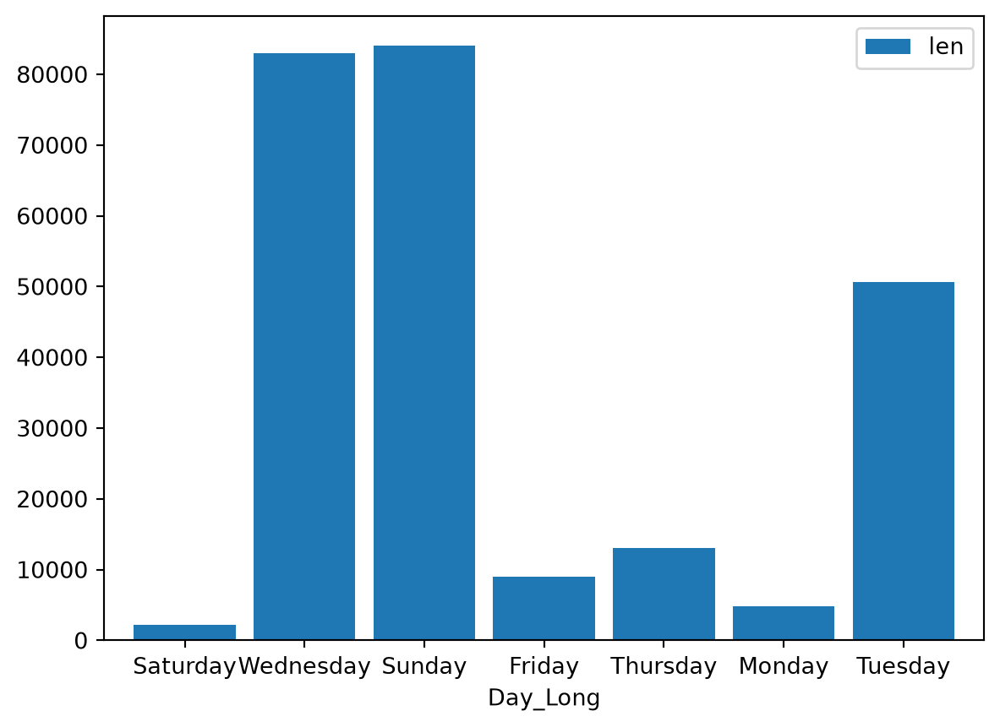
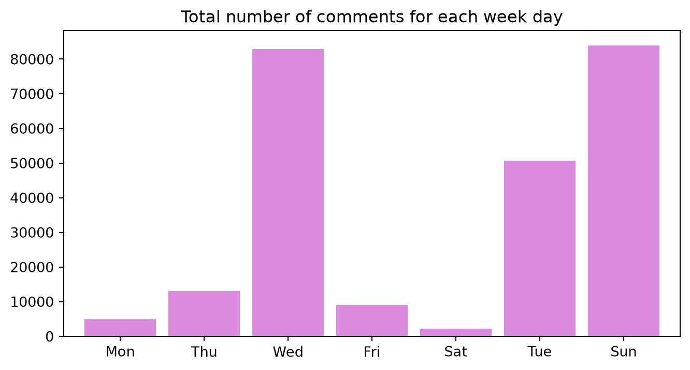

# Getting month and day names from datetime with polars

data analysis

Author

Joram Mutenge

Published

July 16, 2024

When you have timeseries data, you may want to extract the day and month names from the date. Polars makes it easy to do that but the default way doesn’t get you the actual names like “Wednesday” or “January” instead it gives you numbers; 3 for Wednesday and 1 for January.

Here’s my dataset with YouTube comments and the datetime stamp when they were posted.

``` python
import polars as pl
from pathlib import Path

df = (pl.read_parquet(f"{Path('../../')}/datasets/last_week_tonight.parquet")
 .select('text','time_parsed')
 .with_columns(Datetime=pl.from_epoch('time_parsed'))
 .drop('time_parsed')
 )
df.head()
```

shape: (5, 2)

| text                             | Datetime                   |
|----------------------------------|----------------------------|
| str                              | datetime\[μs\]             |
| "The legislator who said he did… | 2024-01-29 04:01:02.696713 |
| "This commentator is no doubt a… | 2024-01-27 16:01:02.712336 |
| "Satanists run this world."      | 2024-01-27 16:01:02.712336 |
| "All abortions are a sacrifice … | 2024-01-27 16:01:02.712336 |
| "I just had a guy say that givi… | 2024-01-25 16:01:02.712336 |

Here’s the default way to get the day and month data from datetime. As I pointed out, it won’t get us the names but it will get us the numbers that match either the day or month.

``` python
(df
 .with_columns(Weekday=pl.col('Datetime').dt.weekday(),
               Month=pl.col('Datetime').dt.month())
 .head()
 )
```

shape: (5, 4)

| text                             | Datetime                   | Weekday | Month |
|----------------------------------|----------------------------|---------|-------|
| str                              | datetime\[μs\]             | i8      | i8    |
| "The legislator who said he did… | 2024-01-29 04:01:02.696713 | 1       | 1     |
| "This commentator is no doubt a… | 2024-01-27 16:01:02.712336 | 6       | 1     |
| "Satanists run this world."      | 2024-01-27 16:01:02.712336 | 6       | 1     |
| "All abortions are a sacrifice … | 2024-01-27 16:01:02.712336 | 6       | 1     |
| "I just had a guy say that givi… | 2024-01-25 16:01:02.712336 | 4       | 1     |

To get the actual names, the code becomes somewhat complicated. You can either get the long name or the short name. Here’s how you do it.

``` python
(df
 .with_columns(Day_Short=pl.col('Datetime').dt.strftime('%a'),
               Day_Long=pl.col('Datetime').dt.strftime('%A'),
               Month_Short=pl.col('Datetime').dt.strftime('%b'),
               Month_Long=pl.col('Datetime').dt.strftime('%B'))
 .head()
 )
```

shape: (5, 6)

| text | Datetime | Day_Short | Day_Long | Month_Short | Month_Long |
|----|----|----|----|----|----|
| str | datetime\[μs\] | str | str | str | str |
| "The legislator who said he did… | 2024-01-29 04:01:02.696713 | "Mon" | "Monday" | "Jan" | "January" |
| "This commentator is no doubt a… | 2024-01-27 16:01:02.712336 | "Sat" | "Saturday" | "Jan" | "January" |
| "Satanists run this world." | 2024-01-27 16:01:02.712336 | "Sat" | "Saturday" | "Jan" | "January" |
| "All abortions are a sacrifice … | 2024-01-27 16:01:02.712336 | "Sat" | "Saturday" | "Jan" | "January" |
| "I just had a guy say that givi… | 2024-01-25 16:01:02.712336 | "Thu" | "Thursday" | "Jan" | "January" |

Why would you want to use short names? For one, they are good for visualizations. Here is a bar chart with long names. You’ll agree that it doesn’t look nice, especially on the right side, because the day names are too close.

``` python
(df
 .with_columns(Day_Short=pl.col('Datetime').dt.strftime('%a'),
               Day_Long=pl.col('Datetime').dt.strftime('%A'),
               Month_Short=pl.col('Datetime').dt.strftime('%b'),
               Month_Long=pl.col('Datetime').dt.strftime('%B'))
 .group_by('Day_Long').len()
 .to_pandas()
 .plot.bar(x='Day_Long', y='len', rot=0, width=.85)
 );
```



Now, here is the same bar chart made with short day names. It’s easy on the eyes because the bar labels are nicely spaced.

``` python
(df
 .with_columns(Day_Short=pl.col('Datetime').dt.strftime('%a'),
               Day_Long=pl.col('Datetime').dt.strftime('%A'),
               Month_Short=pl.col('Datetime').dt.strftime('%b'),
               Month_Long=pl.col('Datetime').dt.strftime('%B'))
 .group_by('Day_Short').len()
 .to_pandas()
 .plot.bar(x='Day_Short',
           y='len',
           rot=0,
           width=.85,
           legend=False,
           color='#dc8add',
           xlabel='',
           title='Total number of comments for each week day',
           figsize=(8,4))
 );
```



If you can’t bring yourself to write the complicated code with percentage signs and letters just to extract day or month names, you can use a library called `polars_xdt`. Here’s how easy it is to get both day and month names.

What’s more, with `polars_xdt` you can get the day names in other languages. The code below shows how to get the French and Ukrainian day names.

``` python
import polars_xdt as xdt

(df
 .with_columns(Weekday=xdt.day_name('Datetime'),
               Month=xdt.month_name('Datetime'))
 .head()
 )
```

shape: (5, 4)

| text | Datetime | Weekday | Month |
|----|----|----|----|
| str | datetime\[μs\] | str | str |
| "The legislator who said he did… | 2024-01-29 04:01:02.696713 | "Monday" | "January" |
| "This commentator is no doubt a… | 2024-01-27 16:01:02.712336 | "Saturday" | "January" |
| "Satanists run this world." | 2024-01-27 16:01:02.712336 | "Saturday" | "January" |
| "All abortions are a sacrifice … | 2024-01-27 16:01:02.712336 | "Saturday" | "January" |
| "I just had a guy say that givi… | 2024-01-25 16:01:02.712336 | "Thursday" | "January" |

However, I couldn’t find a way to get the names in short form using `polars_xdt`. But that’s not too much of a problem because the `slice` method in polars can help us do that.

``` python
(df
 .with_columns(Weekday=xdt.day_name('Datetime'),
               French_Weekday=xdt.day_name('Datetime', locale='fr_FR'),
               Ukranian_Weekday=xdt.day_name('Datetime', locale='uk_UA'))
 .head()
 )
```

shape: (5, 5)

| text | Datetime | Weekday | French_Weekday | Ukranian_Weekday |
|----|----|----|----|----|
| str | datetime\[μs\] | str | str | str |
| "The legislator who said he did… | 2024-01-29 04:01:02.696713 | "Monday" | "lundi" | "понеділок" |
| "This commentator is no doubt a… | 2024-01-27 16:01:02.712336 | "Saturday" | "samedi" | "субота" |
| "Satanists run this world." | 2024-01-27 16:01:02.712336 | "Saturday" | "samedi" | "субота" |
| "All abortions are a sacrifice … | 2024-01-27 16:01:02.712336 | "Saturday" | "samedi" | "субота" |
| "I just had a guy say that givi… | 2024-01-25 16:01:02.712336 | "Thursday" | "jeudi" | "четвер" |

Check out my [Polars course](https://www.udemy.com/course/analyzing-data-with-polars-in-python/) to take full advantage of this new powerful library.
