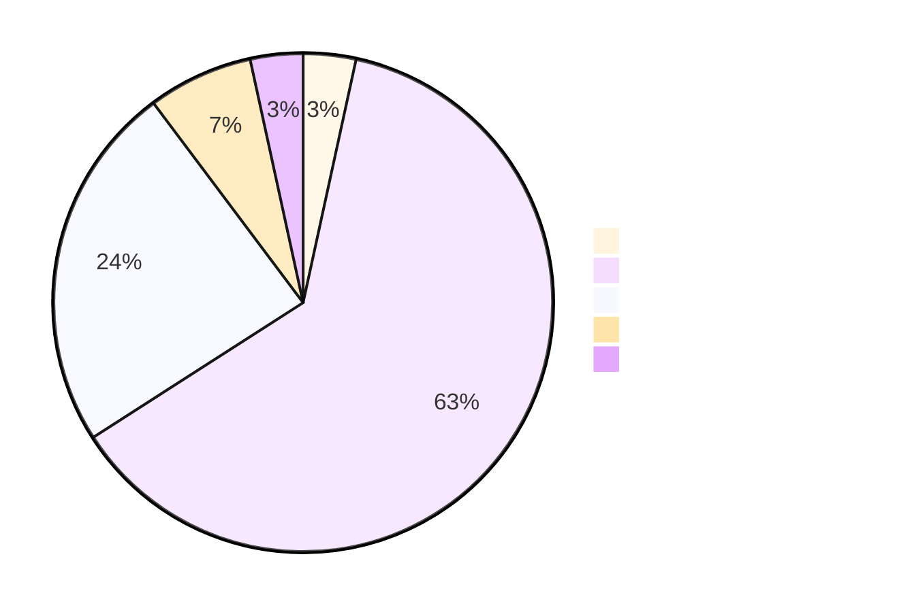
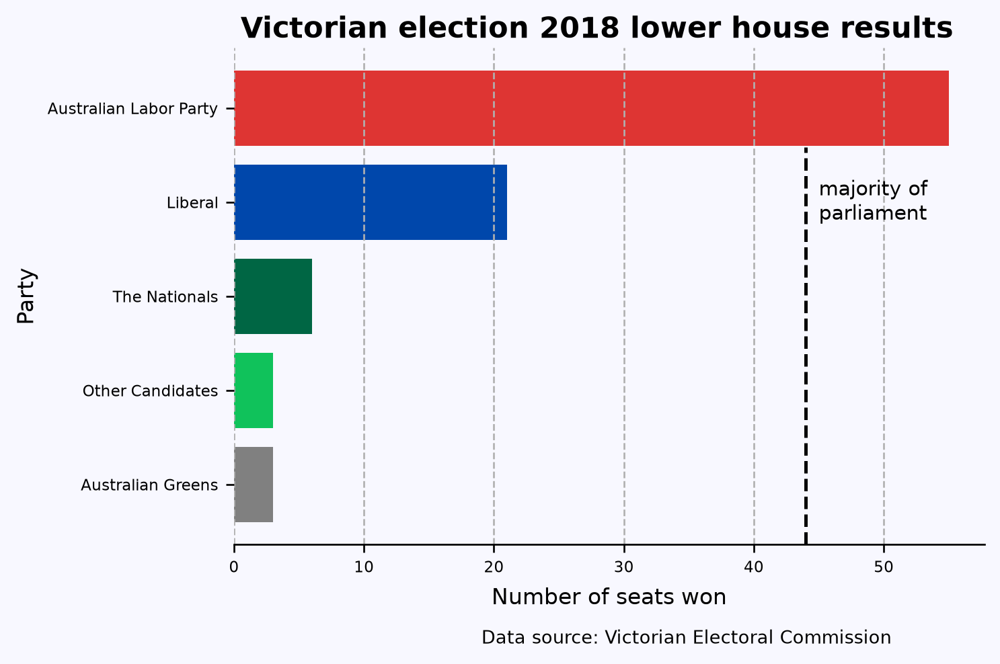
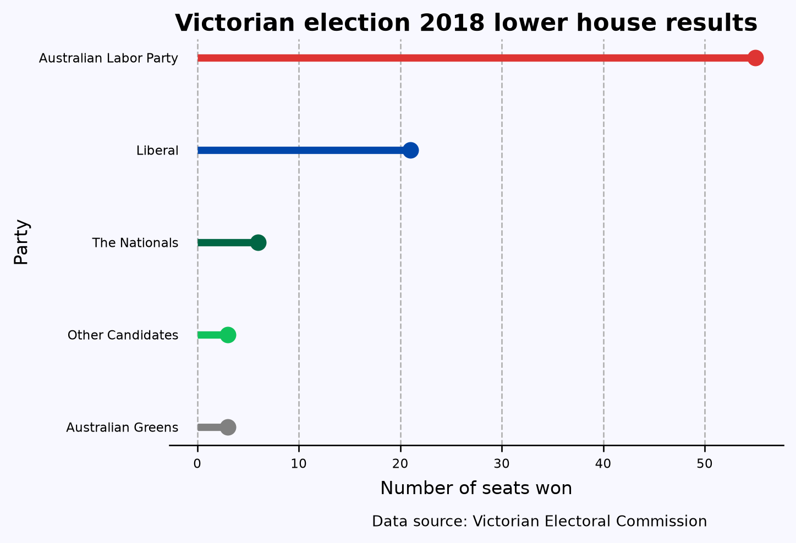

# Making beautiful bar charts with matplotlib

visualization

Author

Joram Mutenge

Published

June 30, 2024

Bar charts are one of the most common and informative ways to represent it. They’re also easy to create. But to make them more informative and beautiful, you must spend some time. This post is a step-by-step description of how to do that.

I’ll use the number of seats won by each political party in the [2018 Victorian state election](https://www.vec.vic.gov.au/Results/State2018/Summary.html) as an example. Victorians may remember this election being described as a “*Danslide*”, where Labor, led by Premier Daniel Andrews, won acclaim majority of seats. Below is the data used.

``` python
import polars as pl

df = pl.DataFrame({
    'Party': ['Australian Greens', 'Australian Labor Party', 'Liberal', 'The Nationals', 'Other Candidates'],
    'Seats_Won': [3, 55, 21, 6, 3]
})

df
```

shape: (5, 2)

| Party                    | Seats_Won |
|--------------------------|-----------|
| str                      | i64       |
| "Australian Greens"      | 3         |
| "Australian Labor Party" | 55        |
| "Liberal"                | 21        |
| "The Nationals"          | 6         |
| "Other Candidates"       | 3         |

Representing the above data with a pie chart wouldn’t be wrong, but it would be less informative. Let’s try it and then compare it with the final bar chart.



When creating a bar chart, always ask if you’d be better off creating a different type of plot entirely. Bar charts are most suitable for displaying counts, percentages, or other quantities where zero has a special meaning. Your axis on a bar chart should always start at zero, or the area of the bar gives a misleading visual impression. Other ways of representing data, such as box plots or points with error bars, may be more appropriate for quantities where zero is not an important reference point. For timeseries data, a continuous line (perhaps with points at the times where observations were made) is almost always better than a sequence of bars.

Another question is which axis should have the categorical variable and which axis should have the numerical variable. Having the categories on the y-axis often works best. It gives you more space when you have either a large number of categories or categories with long labels.

``` python
# Default plot
import hvplot.polars
df.hvplot.barh(x='Party')
```

The bar chart above is a good starting point, but a few things could be improved. To begin with, the order of the values is random. The easiest way to fix this is to sort the data alphabetically on the party categories or biggest to smallest on seats won. The latter is the best choice. I’ll use `.sort()` method.

``` python
(df
 .sort('Seats_Won')
 .hvplot.barh(x='Party')
 )
```

If I was doing exploratory data analysis, or making a quick plot to show a colleague, I might stop at this point. But there is still plenty of room for improvement. For instance, the axis labels are the variable names in our dataframe, which is better than no labels, but are usually too brief or jargon-laden for a wider audience. A good plot can be interpreted clearly with as little supporting information as possible — remember that a reader’s eye will be drawn to a large, colorful figure and ignore the paragraphs of text you’ve written describing the full context.

I’m going to turn to *Matplotlib* to make the additional improvements. However, since polars dataframes are incompatible with matplotlib, I’ll have to convert the dataframe to a pandas one using `.to_pandas()` Then I’ll rename the x-axis and y-axis labels with `.set_xlabel()` and `.set_ylabel()` respectively and increase the font sizes.

Also, following convention, I’ve colored the bars with their respective party colors. I’ve also added a title and a caption indicating the source of the data; these wouldn’t normally be included in an academic publication but are a great idea for a plot that might be copied out of context.

``` python
df_pandas = df.sort('Seats_Won').to_pandas()

from matplotlib import pyplot as plt
plt.rc('font', size=7)

fig, ax = plt.subplots(figsize=(6,4), facecolor='#F8F8FF', dpi=120)
ax.spines[['left','top','right']].set_visible(False) #turn off all spines
ax.set_facecolor('#F8F8FF')

ax.barh('Party', 'Seats_Won', data=df_pandas, color=['#808080', "#10C25B", "#006644", "#0047AB", "#DE3533"])
ax.set_ylabel('Party', fontdict={'size':10})
ax.set_xlabel('Number of seats won', fontdict={'size':10}, labelpad=5)
ax.xaxis.grid(linestyle='--')
fig.suptitle('Victorian election 2018 lower house results', fontsize=13, weight=800, y=.93)

# Adding the vertical line
ax.axvline(x=44, ymin=0, ymax=0.8, color='k', linestyle='--', linewidth=1.5)

# Adding the text to the right of the vertical line
ax.text(44 + 1, 3, 'majority of\nparliament', ha='left', va='center', fontsize=9, color='k')

fig.text(0.804, -0.05, 'Data source: Victorian Electoral Commission', ha='right', fontsize=8, va='bottom')
plt.show();
```

    findfont: Failed to find font weight 800, now using 700.



Now you see that this chart is more informative than the pie chart above!

> **TIP:**
>
> `axvline()` creates the vertical line between 40 and 50.
>
> `xaxis.grid()` adds vertical grid lines to the chart.
>
> `ax.text()` adds the words “*majority of par…*” on the right of vertical line.
>
> `fig.text()` adds the caption showing the data source.

Finally, another good option for representing this data is a line with a point at the end called the lollipop chart. The point draws the eye to the end of the line, which is the actual value being represented. You can create this using ax.hlines() and ax.plot()Below is the resulting chart.

``` python
# Colors for each party
colors = ['#808080', '#10C25B', '#006644', '#0047AB', '#DE3533']

plt.rc('font', size=7)

fig, ax = plt.subplots(figsize=(6,4), facecolor='#F8F8FF', dpi=120)
ax.spines[['left', 'top', 'right']].set_visible(False)  # turn off all spines
ax.set_facecolor('#F8F8FF')

# Plotting the lollipop chart
y = df_pandas['Party']
x = df_pandas['Seats_Won']

for i in range(len(x)):
    ax.hlines(y[i], 0, x[i], color=colors[i], linestyle='-', linewidth=4)  # lines
    ax.plot(x[i], y[i], 'o', color=colors[i], ms=8)  # circles at the end

ax.set_ylabel('Party', fontdict={'size': 10})
ax.set_xlabel('Number of seats won', fontdict={'size': 10}, labelpad=5)
ax.xaxis.grid(linestyle='--')
fig.suptitle('Victorian election 2018 lower house results', fontsize=13, weight=800, y=0.93)

# Removing y-axis tick marks and reducing the gap between tick labels and the y-axis
ax.tick_params(axis='y', which='both', length=0)  # Remove tick marks
ax.yaxis.set_tick_params(pad=-5)  # Reduce the gap between tick labels and the y-axis

fig.text(0.804, -0.05, 'Data source: Victorian Electoral Commission', ha='right', fontsize=8, va='bottom')
plt.show()
```



This post was a re-creation of Cameron Patrick’s [original post](https://cameronpatrick.com/post/2020/03/beautiful-bar-charts-ggplot/) where he used the R programming language and ggplot2.
