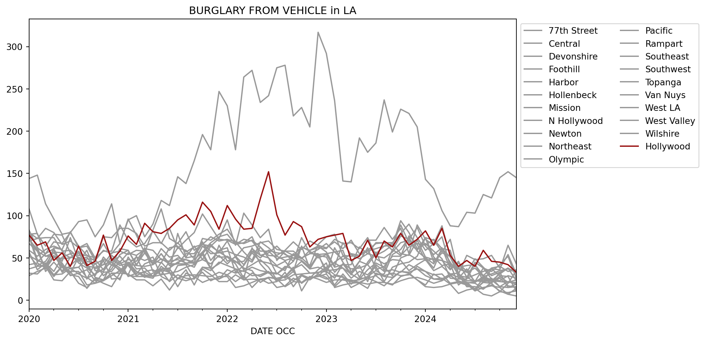
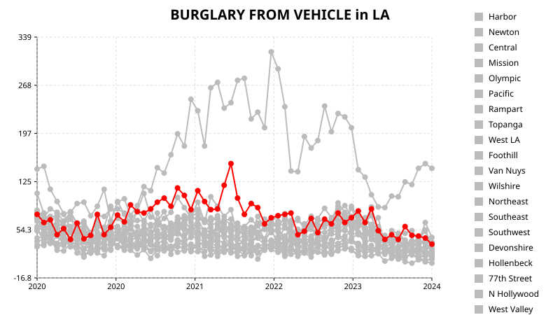
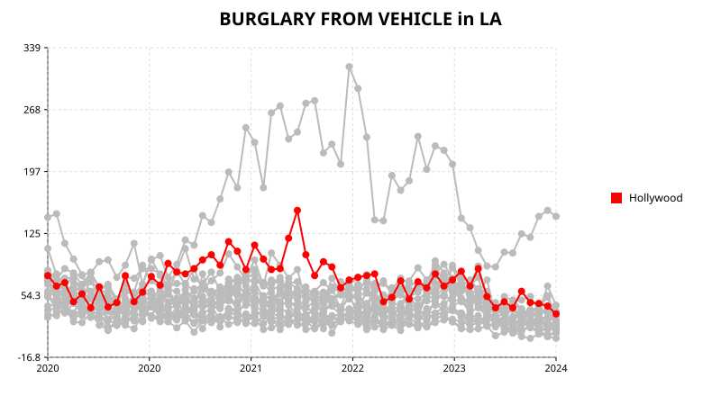

# Slicing and dicing pandas & polars dataframes

How to select subsets of rows and columns

data analysis

Author

Joram Mutenge

Published

2026-06-08

A few years ago, I read an article on pandas’ `loc` method by Matt Harrison, published on the now-defunct Ponder website. I loved reading it because it showed, in depth, the many ways to use `loc`. I want to revisit the article and perform in Polars the operations that Matt performed in pandas. Matt also created a chart at the end of the article using pandas’ built-in charting library, which relies on Matplotlib. I’ll recreate two versions of the same chart: one using HvPlot and the other using Glyphx, a new charting library I’m slowly falling in love with.

## The dataset

The dataset we’ll be analyzing contains crime data from neighborhoods in Los Angeles. I’ll read the dataset with pandas and store it in a variable called *df*. The Polars dataframe will be stored in a variable called *data*.

``` python
import pandas as pd

url = "https://data.lacity.org/api/views/2nrs-mtv8/rows.csv?accessType=DOWNLOAD"
df = pd.read_csv(url)
df.head()
```

|  | DR_NO | Date Rptd | DATE OCC | TIME OCC | AREA | AREA NAME | Rpt Dist No | Part 1-2 | Crm Cd | Crm Cd Desc | ... | Status | Status Desc | Crm Cd 1 | Crm Cd 2 | Crm Cd 3 | Crm Cd 4 | LOCATION | Cross Street | LAT | LON |
|----|----|----|----|----|----|----|----|----|----|----|----|----|----|----|----|----|----|----|----|----|----|
| 0 | 211507896 | 04/11/2021 12:00:00 AM | 11/07/2020 12:00:00 AM | 845 | 15 | N Hollywood | 1502 | 2 | 354 | THEFT OF IDENTITY | ... | IC | Invest Cont | 354.0 | NaN | NaN | NaN | 7800    BEEMAN                       AV | NaN | 34.2124 | -118.4092 |
| 1 | 201516622 | 10/21/2020 12:00:00 AM | 10/18/2020 12:00:00 AM | 1845 | 15 | N Hollywood | 1521 | 1 | 230 | ASSAULT WITH DEADLY WEAPON, AGGRAVATED ASSAULT | ... | IC | Invest Cont | 230.0 | NaN | NaN | NaN | ATOLL                        AV | N  GAULT | 34.1993 | -118.4203 |
| 2 | 240913563 | 12/10/2024 12:00:00 AM | 10/30/2020 12:00:00 AM | 1240 | 9 | Van Nuys | 933 | 2 | 354 | THEFT OF IDENTITY | ... | IC | Invest Cont | 354.0 | NaN | NaN | NaN | 14600    SYLVAN                       ST | NaN | 34.1847 | -118.4509 |
| 3 | 210704711 | 12/24/2020 12:00:00 AM | 12/24/2020 12:00:00 AM | 1310 | 7 | Wilshire | 782 | 1 | 331 | THEFT FROM MOTOR VEHICLE - GRAND (\$950.01 AND ... | ... | IC | Invest Cont | 331.0 | NaN | NaN | NaN | 6000    COMEY                        AV | NaN | 34.0339 | -118.3747 |
| 4 | 201418201 | 10/03/2020 12:00:00 AM | 09/29/2020 12:00:00 AM | 1830 | 14 | Pacific | 1454 | 1 | 420 | THEFT FROM MOTOR VEHICLE - PETTY (\$950 & UNDER) | ... | IC | Invest Cont | 420.0 | NaN | NaN | NaN | 4700    LA VILLA MARINA | NaN | 33.9813 | -118.4350 |

5 rows × 28 columns

I’ll read the dataset again with Polars.

``` python
import polars as pl

data = pl.read_csv(url)
data.head()
```

shape: (5, 28)

| DR_NO | Date Rptd | DATE OCC | TIME OCC | AREA | AREA NAME | Rpt Dist No | Part 1-2 | Crm Cd | Crm Cd Desc | Mocodes | Vict Age | Vict Sex | Vict Descent | Premis Cd | Premis Desc | Weapon Used Cd | Weapon Desc | Status | Status Desc | Crm Cd 1 | Crm Cd 2 | Crm Cd 3 | Crm Cd 4 | LOCATION | Cross Street | LAT | LON |
|----|----|----|----|----|----|----|----|----|----|----|----|----|----|----|----|----|----|----|----|----|----|----|----|----|----|----|----|
| i64 | str | str | i64 | i64 | str | i64 | i64 | i64 | str | str | i64 | str | str | i64 | str | i64 | str | str | str | i64 | i64 | str | str | str | str | f64 | f64 |
| 211507896 | "04/11/2021 12:00:00 AM" | "11/07/2020 12:00:00 AM" | 845 | 15 | "N Hollywood" | 1502 | 2 | 354 | "THEFT OF IDENTITY" | "0377" | 31 | "M" | "H" | 501 | "SINGLE FAMILY DWELLING" | null | null | "IC" | "Invest Cont" | 354 | null | null | null | "7800    BEEMAN                … | null | 34.2124 | -118.4092 |
| 201516622 | "10/21/2020 12:00:00 AM" | "10/18/2020 12:00:00 AM" | 1845 | 15 | "N Hollywood" | 1521 | 1 | 230 | "ASSAULT WITH DEADLY WEAPON, AG… | "0416 0334 2004 1822 1414 0305 … | 32 | "M" | "H" | 102 | "SIDEWALK" | 200 | "KNIFE WITH BLADE 6INCHES OR LE… | "IC" | "Invest Cont" | 230 | null | null | null | "ATOLL                        A… | "N  GAULT" | 34.1993 | -118.4203 |
| 240913563 | "12/10/2024 12:00:00 AM" | "10/30/2020 12:00:00 AM" | 1240 | 9 | "Van Nuys" | 933 | 2 | 354 | "THEFT OF IDENTITY" | "0377" | 30 | "M" | "W" | 501 | "SINGLE FAMILY DWELLING" | null | null | "IC" | "Invest Cont" | 354 | null | null | null | "14600    SYLVAN               … | null | 34.1847 | -118.4509 |
| 210704711 | "12/24/2020 12:00:00 AM" | "12/24/2020 12:00:00 AM" | 1310 | 7 | "Wilshire" | 782 | 1 | 331 | "THEFT FROM MOTOR VEHICLE - GRA… | "0344" | 47 | "F" | "A" | 101 | "STREET" | null | null | "IC" | "Invest Cont" | 331 | null | null | null | "6000    COMEY                 … | null | 34.0339 | -118.3747 |
| 201418201 | "10/03/2020 12:00:00 AM" | "09/29/2020 12:00:00 AM" | 1830 | 14 | "Pacific" | 1454 | 1 | 420 | "THEFT FROM MOTOR VEHICLE - PET… | "1300 0344 1606 2032" | 63 | "M" | "H" | 103 | "ALLEY" | null | null | "IC" | "Invest Cont" | 420 | null | null | null | "4700    LA VILLA MARINA" | null | 33.9813 | -118.435 |

## Selecting a row

The `loc` method in pandas can be used to select specific rows and columns. I’ll select the fifth row in the dataframe.

``` python
df.loc[5]
```

    DR_NO                                                240412063
    Date Rptd                               12/11/2024 12:00:00 AM
    DATE OCC                                11/11/2020 12:00:00 AM
    TIME OCC                                                  1210
    AREA                                                         4
    AREA NAME                                           Hollenbeck
    Rpt Dist No                                                429
    Part 1-2                                                     2
    Crm Cd                                                     354
    Crm Cd Desc                                  THEFT OF IDENTITY
    Mocodes                                                   0100
    Vict Age                                                    35
    Vict Sex                                                     M
    Vict Descent                                                 B
    Premis Cd                                                502.0
    Premis Desc       MULTI-UNIT DWELLING (APARTMENT, DUPLEX, ETC)
    Weapon Used Cd                                             NaN
    Weapon Desc                                                NaN
    Status                                                      IC
    Status Desc                                        Invest Cont
    Crm Cd 1                                                 354.0
    Crm Cd 2                                                   NaN
    Crm Cd 3                                                   NaN
    Crm Cd 4                                                   NaN
    LOCATION               5300    CRONUS                       ST
    Cross Street                                               NaN
    LAT                                                     34.083
    LON                                                  -118.1678
    Name: 5, dtype: object

Let’s do the same with Polars. I’ll show two ways to select a specific row.

**Version 1**

``` python
(data
 .slice(5, 1)
 )
```

shape: (1, 28)

| DR_NO | Date Rptd | DATE OCC | TIME OCC | AREA | AREA NAME | Rpt Dist No | Part 1-2 | Crm Cd | Crm Cd Desc | Mocodes | Vict Age | Vict Sex | Vict Descent | Premis Cd | Premis Desc | Weapon Used Cd | Weapon Desc | Status | Status Desc | Crm Cd 1 | Crm Cd 2 | Crm Cd 3 | Crm Cd 4 | LOCATION | Cross Street | LAT | LON |
|----|----|----|----|----|----|----|----|----|----|----|----|----|----|----|----|----|----|----|----|----|----|----|----|----|----|----|----|
| i64 | str | str | i64 | i64 | str | i64 | i64 | i64 | str | str | i64 | str | str | i64 | str | i64 | str | str | str | i64 | i64 | str | str | str | str | f64 | f64 |
| 240412063 | "12/11/2024 12:00:00 AM" | "11/11/2020 12:00:00 AM" | 1210 | 4 | "Hollenbeck" | 429 | 2 | 354 | "THEFT OF IDENTITY" | "0100" | 35 | "M" | "B" | 502 | "MULTI-UNIT DWELLING (APARTMENT… | null | null | "IC" | "Invest Cont" | 354 | null | null | null | "5300    CRONUS                … | null | 34.083 | -118.1678 |

**Version 2**

``` python
(data
 .gather(5)
 )
```

shape: (1, 28)

| DR_NO | Date Rptd | DATE OCC | TIME OCC | AREA | AREA NAME | Rpt Dist No | Part 1-2 | Crm Cd | Crm Cd Desc | Mocodes | Vict Age | Vict Sex | Vict Descent | Premis Cd | Premis Desc | Weapon Used Cd | Weapon Desc | Status | Status Desc | Crm Cd 1 | Crm Cd 2 | Crm Cd 3 | Crm Cd 4 | LOCATION | Cross Street | LAT | LON |
|----|----|----|----|----|----|----|----|----|----|----|----|----|----|----|----|----|----|----|----|----|----|----|----|----|----|----|----|
| i64 | str | str | i64 | i64 | str | i64 | i64 | i64 | str | str | i64 | str | str | i64 | str | i64 | str | str | str | i64 | i64 | str | str | str | str | f64 | f64 |
| 240412063 | "12/11/2024 12:00:00 AM" | "11/11/2020 12:00:00 AM" | 1210 | 4 | "Hollenbeck" | 429 | 2 | 354 | "THEFT OF IDENTITY" | "0100" | 35 | "M" | "B" | 502 | "MULTI-UNIT DWELLING (APARTMENT… | null | null | "IC" | "Invest Cont" | 354 | null | null | null | "5300    CRONUS                … | null | 34.083 | -118.1678 |

Personally, I prefer version 2, but you can use whichever one you like.

> **NOTE:**
>
> You’ve probably noticed that the selected row is displayed differently by the two libraries. Polars displays it horizontally, while pandas displays it vertically.

If we wanted Polars to produce output closer to the pandas output, we could use `to_dict` to produce a list and then retrieve the first item in that list, which happens to be the dictionary we want.

``` python
(data
 .gather(5)
 .to_dicts()[0]
 )
```

    {'DR_NO': 240412063,
     'Date Rptd': '12/11/2024 12:00:00 AM',
     'DATE OCC': '11/11/2020 12:00:00 AM',
     'TIME OCC': 1210,
     'AREA': 4,
     'AREA NAME': 'Hollenbeck',
     'Rpt Dist No': 429,
     'Part 1-2': 2,
     'Crm Cd': 354,
     'Crm Cd Desc': 'THEFT OF IDENTITY',
     'Mocodes': '0100',
     'Vict Age': 35,
     'Vict Sex': 'M',
     'Vict Descent': 'B',
     'Premis Cd': 502,
     'Premis Desc': 'MULTI-UNIT DWELLING (APARTMENT, DUPLEX, ETC)',
     'Weapon Used Cd': None,
     'Weapon Desc': None,
     'Status': 'IC',
     'Status Desc': 'Invest Cont',
     'Crm Cd 1': 354,
     'Crm Cd 2': None,
     'Crm Cd 3': None,
     'Crm Cd 4': None,
     'LOCATION': '5300    CRONUS                       ST',
     'Cross Street': None,
     'LAT': 34.083,
     'LON': -118.1678}

Although this is a dictionary, it is displayed vertically and therefore looks closer to the pandas output.

## Selecting columns

Now let’s use `loc` to select a single column in *df*. The `:` means “return all the rows in the dataframe.”

``` python
df.loc[:, 'Crm Cd 1']
```

    0          354.0
    1          230.0
    2          354.0
    3          331.0
    4          420.0
               ...  
    1004889    510.0
    1004890    745.0
    1004891    341.0
    1004892    230.0
    1004893    510.0
    Name: Crm Cd 1, Length: 1004894, dtype: float64

In Polars, we can display a single column by using the `select` method.

``` python
data.select('Crm Cd 1')
```

shape: (1_004_894, 1)

| Crm Cd 1 |
|----------|
| i64      |
| 354      |
| 230      |
| 354      |
| 331      |
| 420      |
| …        |
| 510      |
| 745      |
| 341      |
| 230      |
| 510      |

The first thing to note between these two outputs is that when a single column is selected in pandas, the output is a series, unlike in Polars, where the output is always a dataframe regardless of how many columns you select. Another difference is that the pandas output shows an index. Polars dataframes, on the other hand, do not have an index unless you create one.

If we really want the Polars output to be a series as well, we can do it with `to_series`.

``` python
(data
 .select('Crm Cd 1')
 .to_series()
 )
```

shape: (1_004_894,)

| Crm Cd 1 |
|----------|
| i64      |
| 354      |
| 230      |
| 354      |
| 331      |
| 420      |
| …        |
| 510      |
| 745      |
| 341      |
| 230      |
| 510      |

The two Polars outputs look the same, but they are different types. The way I distinguish between them is by looking at their shape at the top. The dataframe shows both the number of rows and columns: (1004894, 1), while the series only shows the number of rows: (1004894,).

Here’s how we can select two columns and all the rows in the pandas dataframe.

``` python
df.loc[:, ['AREA', 'TIME OCC']]
```

|         | AREA | TIME OCC |
|---------|------|----------|
| 0       | 15   | 845      |
| 1       | 15   | 1845     |
| 2       | 9    | 1240     |
| 3       | 7    | 1310     |
| 4       | 14   | 1830     |
| ...     | ...  | ...      |
| 1004889 | 7    | 1400     |
| 1004890 | 1    | 100      |
| 1004891 | 4    | 2330     |
| 1004892 | 3    | 1500     |
| 1004893 | 9    | 2300     |

1004894 rows × 2 columns

And here’s how to do it the Polars way.

``` python
(data
 .select('AREA','TIME OCC')
 )
```

shape: (1_004_894, 2)

| AREA | TIME OCC |
|------|----------|
| i64  | i64      |
| 15   | 845      |
| 15   | 1845     |
| 9    | 1240     |
| 7    | 1310     |
| 14   | 1830     |
| …    | …        |
| 7    | 1400     |
| 1    | 100      |
| 4    | 2330     |
| 3    | 1500     |
| 9    | 2300     |

## Combine with list of rows and column labels

We can use a list to select the rows we want to return in both pandas and Polars dataframes.

``` python
df.loc[[0,1,2], ['AREA', 'TIME OCC']]
```

|     | AREA | TIME OCC |
|-----|------|----------|
| 0   | 15   | 845      |
| 1   | 15   | 1845     |
| 2   | 9    | 1240     |

In a Polars dataframe, it is not necessary to use a list to select columns.

``` python
(data
 .gather([0,1,2])
 .select('AREA', 'TIME OCC')
 )
```

shape: (3, 2)

| AREA | TIME OCC |
|------|----------|
| i64  | i64      |
| 15   | 845      |
| 15   | 1845     |
| 9    | 1240     |

## Selecting rows and columns over a range

Instead of listing the rows or columns we want to select, we can select them over a range. Let’s get the rows from 0 to 2 and the columns from *TIME OCC* to *Part 1-2* in both dataframes.

``` python
df.loc[0:2, 'TIME OCC':'Part 1-2']
```

|     | TIME OCC | AREA | AREA NAME   | Rpt Dist No | Part 1-2 |
|-----|----------|------|-------------|-------------|----------|
| 0   | 845      | 15   | N Hollywood | 1502        | 2        |
| 1   | 1845     | 15   | N Hollywood | 1521        | 1        |
| 2   | 1240     | 9    | Van Nuys    | 933         | 2        |

> **NOTE:**
>
> In pandas, range selection using `loc` is inclusive. Thus, selecting rows from 0 to 2 includes the row at index position 2.

It turns out that in Polars, there is no direct way to select columns over a range by their names. However, we can achieve the same result as in the pandas example using two workarounds. Both require selecting columns by their index positions.

I’ll begin with the one that uses a list comprehension.

``` python
cols = data.columns
data.slice(0, 3).select(cols[cols.index("TIME OCC") : cols.index("Part 1-2") + 1])
```

shape: (3, 5)

| TIME OCC | AREA | AREA NAME     | Rpt Dist No | Part 1-2 |
|----------|------|---------------|-------------|----------|
| i64      | i64  | str           | i64         | i64      |
| 845      | 15   | "N Hollywood" | 1502        | 2        |
| 1845     | 15   | "N Hollywood" | 1521        | 1        |
| 1240     | 9    | "Van Nuys"    | 933         | 2        |

> **NOTE:**
>
> We added 1 because, in Polars, index selection is not inclusive. Without it, we would miss the *Part 1-2* column in the resulting dataframe.

I would argue that the above method is not idiomatic. List comprehensions are not native to Polars; remember that the library is written in Rust. Here’s the idiomatic approach.

``` python
(data
 .select(pl.nth(range(data.get_column_index('TIME OCC'), data.get_column_index('Part 1-2') + 1)))
 )
```

shape: (1_004_894, 5)

| TIME OCC | AREA | AREA NAME     | Rpt Dist No | Part 1-2 |
|----------|------|---------------|-------------|----------|
| i64      | i64  | str           | i64         | i64      |
| 845      | 15   | "N Hollywood" | 1502        | 2        |
| 1845     | 15   | "N Hollywood" | 1521        | 1        |
| 1240     | 9    | "Van Nuys"    | 933         | 2        |
| 1310     | 7    | "Wilshire"    | 782         | 1        |
| 1830     | 14   | "Pacific"     | 1454        | 1        |
| …        | …    | …             | …           | …        |
| 1400     | 7    | "Wilshire"    | 788         | 1        |
| 100      | 1    | "Central"     | 101         | 2        |
| 2330     | 4    | "Hollenbeck"  | 421         | 1        |
| 1500     | 3    | "Southwest"   | 358         | 1        |
| 2300     | 9    | "Van Nuys"    | 914         | 1        |

Because `loc` accepts list comprehensions, we can add logic to customize our row or column selection. The example below pulls out every third row and selects only the columns that contain *‘Crm’* in their names.

``` python
df.loc[[True if i%3 == 2 else False for i in range(len(df))],
       [True if 'Crm' in col else False for col in df.columns]] 
```

|  | Crm Cd | Crm Cd Desc | Crm Cd 1 | Crm Cd 2 | Crm Cd 3 | Crm Cd 4 |
|----|----|----|----|----|----|----|
| 2 | 354 | THEFT OF IDENTITY | 354.0 | NaN | NaN | NaN |
| 5 | 354 | THEFT OF IDENTITY | 354.0 | NaN | NaN | NaN |
| 8 | 354 | THEFT OF IDENTITY | 354.0 | NaN | NaN | NaN |
| 11 | 354 | THEFT OF IDENTITY | 354.0 | NaN | NaN | NaN |
| 14 | 330 | BURGLARY FROM VEHICLE | 330.0 | NaN | NaN | NaN |
| ... | ... | ... | ... | ... | ... | ... |
| 1004879 | 354 | THEFT OF IDENTITY | 354.0 | NaN | NaN | NaN |
| 1004882 | 230 | ASSAULT WITH DEADLY WEAPON, AGGRAVATED ASSAULT | 230.0 | NaN | NaN | NaN |
| 1004885 | 440 | THEFT PLAIN - PETTY (\$950 & UNDER) | 440.0 | NaN | NaN | NaN |
| 1004888 | 341 | THEFT-GRAND (\$950.01 & OVER)EXCPT,GUNS,FOWL,LI... | 341.0 | NaN | NaN | NaN |
| 1004891 | 341 | THEFT-GRAND (\$950.01 & OVER)EXCPT,GUNS,FOWL,LI... | 341.0 | NaN | NaN | NaN |

334964 rows × 6 columns

We can achieve similar results in Polars by creating an index or by using `gather_every`. The example below creates an index on the dataframe and performs a modulo calculation on the generated index numbers to get the desired rows. Then we use a regex pattern to select the columns that contain the string *‘Crm’*.

``` python
(data
 .with_row_index()
 .filter(pl.col('index') % 3 == 2)
 .select(pl.col('^.*Crm.*$'))
)
```

shape: (334_964, 6)

| Crm Cd | Crm Cd Desc                       | Crm Cd 1 | Crm Cd 2 | Crm Cd 3 | Crm Cd 4 |
|--------|-----------------------------------|----------|----------|----------|----------|
| i64    | str                               | i64      | i64      | str      | str      |
| 354    | "THEFT OF IDENTITY"               | 354      | null     | null     | null     |
| 354    | "THEFT OF IDENTITY"               | 354      | null     | null     | null     |
| 354    | "THEFT OF IDENTITY"               | 354      | null     | null     | null     |
| 354    | "THEFT OF IDENTITY"               | 354      | null     | null     | null     |
| 330    | "BURGLARY FROM VEHICLE"           | 330      | null     | null     | null     |
| …      | …                                 | …        | …        | …        | …        |
| 354    | "THEFT OF IDENTITY"               | 354      | null     | null     | null     |
| 230    | "ASSAULT WITH DEADLY WEAPON, AG…  | 230      | null     | null     | null     |
| 440    | "THEFT PLAIN - PETTY (\$950 & UN… | 440      | null     | null     | null     |
| 341    | "THEFT-GRAND (\$950.01 & OVER)EX… | 341      | null     | null     | null     |
| 341    | "THEFT-GRAND (\$950.01 & OVER)EX… | 341      | null     | null     | null     |

An even more idiomatic way to write the above code is by using `gather_every`.

``` python
(data
 .gather_every(3, offset=2) # <1>
 .select(pl.col('^.*Crm.*$'))
)
```

1.  Remember that the condition `% 3 == 2` keeps rows where the index has a remainder of 2 when divided by 3, i.e., indices 2, 5, 8, 11, and so on. Therefore, the first row selected is index 2, which maps directly to `offset=2`.

shape: (334_964, 6)

| Crm Cd | Crm Cd Desc                       | Crm Cd 1 | Crm Cd 2 | Crm Cd 3 | Crm Cd 4 |
|--------|-----------------------------------|----------|----------|----------|----------|
| i64    | str                               | i64      | i64      | str      | str      |
| 354    | "THEFT OF IDENTITY"               | 354      | null     | null     | null     |
| 354    | "THEFT OF IDENTITY"               | 354      | null     | null     | null     |
| 354    | "THEFT OF IDENTITY"               | 354      | null     | null     | null     |
| 354    | "THEFT OF IDENTITY"               | 354      | null     | null     | null     |
| 330    | "BURGLARY FROM VEHICLE"           | 330      | null     | null     | null     |
| …      | …                                 | …        | …        | …        | …        |
| 354    | "THEFT OF IDENTITY"               | 354      | null     | null     | null     |
| 230    | "ASSAULT WITH DEADLY WEAPON, AG…  | 230      | null     | null     | null     |
| 440    | "THEFT PLAIN - PETTY (\$950 & UN… | 440      | null     | null     | null     |
| 341    | "THEFT-GRAND (\$950.01 & OVER)EX… | 341      | null     | null     | null     |
| 341    | "THEFT-GRAND (\$950.01 & OVER)EX… | 341      | null     | null     | null     |

Just to show off how versatile Polars is, I’ll demonstrate other interesting ways to write the code above. I’ll begin with the one that uses the `arange` function. This also eliminates the need for an index.

``` python
(data
 .filter((pl.arange(0, pl.len()) % 3) == 2)
 .select(pl.col('^.*Crm.*$'))
 )
```

shape: (334_964, 6)

| Crm Cd | Crm Cd Desc                       | Crm Cd 1 | Crm Cd 2 | Crm Cd 3 | Crm Cd 4 |
|--------|-----------------------------------|----------|----------|----------|----------|
| i64    | str                               | i64      | i64      | str      | str      |
| 354    | "THEFT OF IDENTITY"               | 354      | null     | null     | null     |
| 354    | "THEFT OF IDENTITY"               | 354      | null     | null     | null     |
| 354    | "THEFT OF IDENTITY"               | 354      | null     | null     | null     |
| 354    | "THEFT OF IDENTITY"               | 354      | null     | null     | null     |
| 330    | "BURGLARY FROM VEHICLE"           | 330      | null     | null     | null     |
| …      | …                                 | …        | …        | …        | …        |
| 354    | "THEFT OF IDENTITY"               | 354      | null     | null     | null     |
| 230    | "ASSAULT WITH DEADLY WEAPON, AG…  | 230      | null     | null     | null     |
| 440    | "THEFT PLAIN - PETTY (\$950 & UN… | 440      | null     | null     | null     |
| 341    | "THEFT-GRAND (\$950.01 & OVER)EX… | 341      | null     | null     | null     |
| 341    | "THEFT-GRAND (\$950.01 & OVER)EX… | 341      | null     | null     | null     |

We can also use the `int_range` function to get the same result.

``` python
(data
 .filter((pl.int_range(pl.len()) % 3) == 2)
 .select(pl.col('^.*Crm.*$'))
)
```

shape: (334_964, 6)

| Crm Cd | Crm Cd Desc                       | Crm Cd 1 | Crm Cd 2 | Crm Cd 3 | Crm Cd 4 |
|--------|-----------------------------------|----------|----------|----------|----------|
| i64    | str                               | i64      | i64      | str      | str      |
| 354    | "THEFT OF IDENTITY"               | 354      | null     | null     | null     |
| 354    | "THEFT OF IDENTITY"               | 354      | null     | null     | null     |
| 354    | "THEFT OF IDENTITY"               | 354      | null     | null     | null     |
| 354    | "THEFT OF IDENTITY"               | 354      | null     | null     | null     |
| 330    | "BURGLARY FROM VEHICLE"           | 330      | null     | null     | null     |
| …      | …                                 | …        | …        | …        | …        |
| 354    | "THEFT OF IDENTITY"               | 354      | null     | null     | null     |
| 230    | "ASSAULT WITH DEADLY WEAPON, AG…  | 230      | null     | null     | null     |
| 440    | "THEFT PLAIN - PETTY (\$950 & UN… | 440      | null     | null     | null     |
| 341    | "THEFT-GRAND (\$950.01 & OVER)EX… | 341      | null     | null     | null     |
| 341    | "THEFT-GRAND (\$950.01 & OVER)EX… | 341      | null     | null     | null     |

Regex patterns are notorious for being difficult to remember. We can avoid them altogether by using special selectors in Polars.

``` python
import polars.selectors as cs

(data
 .filter(pl.int_range(pl.len()).mod(3) == 2)
 .select(cs.contains('Crm'))
 )
```

shape: (334_964, 6)

| Crm Cd | Crm Cd Desc                       | Crm Cd 1 | Crm Cd 2 | Crm Cd 3 | Crm Cd 4 |
|--------|-----------------------------------|----------|----------|----------|----------|
| i64    | str                               | i64      | i64      | str      | str      |
| 354    | "THEFT OF IDENTITY"               | 354      | null     | null     | null     |
| 354    | "THEFT OF IDENTITY"               | 354      | null     | null     | null     |
| 354    | "THEFT OF IDENTITY"               | 354      | null     | null     | null     |
| 354    | "THEFT OF IDENTITY"               | 354      | null     | null     | null     |
| 330    | "BURGLARY FROM VEHICLE"           | 330      | null     | null     | null     |
| …      | …                                 | …        | …        | …        | …        |
| 354    | "THEFT OF IDENTITY"               | 354      | null     | null     | null     |
| 230    | "ASSAULT WITH DEADLY WEAPON, AG…  | 230      | null     | null     | null     |
| 440    | "THEFT PLAIN - PETTY (\$950 & UN… | 440      | null     | null     | null     |
| 341    | "THEFT-GRAND (\$950.01 & OVER)EX… | 341      | null     | null     | null     |
| 341    | "THEFT-GRAND (\$950.01 & OVER)EX… | 341      | null     | null     | null     |

## Boolean arrays

Most row filtering in pandas uses boolean masks. Let’s begin with a simple example: filter for rows where *AREA NAME* is ‘Central’. The code below produces a boolean mask.

``` python
df['AREA NAME'] == 'Central'
```

    0          False
    1          False
    2          False
    3          False
    4          False
               ...  
    1004889    False
    1004890     True
    1004891    False
    1004892    False
    1004893    False
    Name: AREA NAME, Length: 1004894, dtype: bool

We can use this boolean mask in `loc` to get the desired rows in the dataframe.

``` python
df.loc[df['AREA NAME'] == 'Central']
```

|  | DR_NO | Date Rptd | DATE OCC | TIME OCC | AREA | AREA NAME | Rpt Dist No | Part 1-2 | Crm Cd | Crm Cd Desc | ... | Status | Status Desc | Crm Cd 1 | Crm Cd 2 | Crm Cd 3 | Crm Cd 4 | LOCATION | Cross Street | LAT | LON |
|----|----|----|----|----|----|----|----|----|----|----|----|----|----|----|----|----|----|----|----|----|----|
| 107 | 230110144 | 04/04/2023 12:00:00 AM | 07/03/2020 12:00:00 AM | 900 | 1 | Central | 182 | 2 | 354 | THEFT OF IDENTITY | ... | IC | Invest Cont | 354.0 | NaN | NaN | NaN | 1100 S  GRAND                        AV | NaN | 34.0415 | -118.2620 |
| 563 | 210118909 | 10/19/2021 12:00:00 AM | 06/02/2020 12:00:00 AM | 1605 | 1 | Central | 134 | 1 | 480 | BIKE - STOLEN | ... | IC | Invest Cont | 480.0 | NaN | NaN | NaN | 3RD                          ST | BROADWAY | 34.0510 | -118.2480 |
| 572 | 210104305 | 01/08/2021 12:00:00 AM | 10/28/2020 12:00:00 AM | 1203 | 1 | Central | 182 | 2 | 668 | EMBEZZLEMENT, GRAND THEFT (\$950.01 & OVER) | ... | IC | Invest Cont | 668.0 | NaN | NaN | NaN | 1200 S  FIGUEROA                     ST | NaN | 34.0416 | -118.2671 |
| 1007 | 210110076 | 04/27/2021 12:00:00 AM | 07/01/2020 12:00:00 AM | 1200 | 1 | Central | 155 | 2 | 812 | CRM AGNST CHLD (13 OR UNDER) (14-15 & SUSP 10 ... | ... | AO | Adult Other | 812.0 | 860.0 | NaN | NaN | 200 E  6TH                          ST | NaN | 34.0448 | -118.2474 |
| 1708 | 210104086 | 01/03/2021 12:00:00 AM | 01/03/2020 12:00:00 AM | 1510 | 1 | Central | 101 | 2 | 624 | BATTERY - SIMPLE ASSAULT | ... | IC | Invest Cont | 624.0 | NaN | NaN | NaN | 900    CENTENNIAL                   ST | NaN | 34.0669 | -118.2458 |
| ... | ... | ... | ... | ... | ... | ... | ... | ... | ... | ... | ... | ... | ... | ... | ... | ... | ... | ... | ... | ... | ... |
| 1004822 | 240119704 | 10/09/2024 12:00:00 AM | 10/09/2024 12:00:00 AM | 700 | 1 | Central | 119 | 2 | 888 | TRESPASSING | ... | IC | Invest Cont | 888.0 | NaN | NaN | NaN | 800 N  ALAMEDA                      ST | NaN | 34.0561 | -118.2375 |
| 1004847 | 240109835 | 04/01/2024 12:00:00 AM | 04/01/2024 12:00:00 AM | 1250 | 1 | Central | 152 | 2 | 624 | BATTERY - SIMPLE ASSAULT | ... | IC | Invest Cont | 624.0 | NaN | NaN | NaN | 7TH                          ST | FLOWER                       ST | 34.0490 | -118.2592 |
| 1004868 | 240112635 | 06/10/2024 12:00:00 AM | 06/10/2024 12:00:00 AM | 1855 | 1 | Central | 138 | 1 | 510 | VEHICLE - STOLEN | ... | IC | Invest Cont | 510.0 | NaN | NaN | NaN | 300 S  ALAMEDA                      ST | NaN | 34.0468 | -118.2415 |
| 1004885 | 240119644 | 10/04/2024 12:00:00 AM | 09/27/2024 12:00:00 AM | 2345 | 1 | Central | 142 | 1 | 440 | THEFT PLAIN - PETTY (\$950 & UNDER) | ... | IC | Invest Cont | 440.0 | NaN | NaN | NaN | W  3RD | S  GRAND | 34.0531 | -118.2512 |
| 1004890 | 240104953 | 01/15/2024 12:00:00 AM | 01/15/2024 12:00:00 AM | 100 | 1 | Central | 101 | 2 | 745 | VANDALISM - MISDEAMEANOR (\$399 OR UNDER) | ... | IC | Invest Cont | 745.0 | NaN | NaN | NaN | 1300 W  SUNSET                       BL | NaN | 34.0685 | -118.2460 |

69668 rows × 28 columns

By contrast, Polars does not require a boolean mask to perform this filtering operation.

``` python
(data
 .filter(pl.col('AREA NAME') == 'Central')
 )
```

shape: (69_668, 28)

| DR_NO | Date Rptd | DATE OCC | TIME OCC | AREA | AREA NAME | Rpt Dist No | Part 1-2 | Crm Cd | Crm Cd Desc | Mocodes | Vict Age | Vict Sex | Vict Descent | Premis Cd | Premis Desc | Weapon Used Cd | Weapon Desc | Status | Status Desc | Crm Cd 1 | Crm Cd 2 | Crm Cd 3 | Crm Cd 4 | LOCATION | Cross Street | LAT | LON |
|----|----|----|----|----|----|----|----|----|----|----|----|----|----|----|----|----|----|----|----|----|----|----|----|----|----|----|----|
| i64 | str | str | i64 | i64 | str | i64 | i64 | i64 | str | str | i64 | str | str | i64 | str | i64 | str | str | str | i64 | i64 | str | str | str | str | f64 | f64 |
| 230110144 | "04/04/2023 12:00:00 AM" | "07/03/2020 12:00:00 AM" | 900 | 1 | "Central" | 182 | 2 | 354 | "THEFT OF IDENTITY" | "0930 0929" | 25 | "M" | "H" | 502 | "MULTI-UNIT DWELLING (APARTMENT… | null | null | "IC" | "Invest Cont" | 354 | null | null | null | "1100 S  GRAND                 … | null | 34.0415 | -118.262 |
| 210118909 | "10/19/2021 12:00:00 AM" | "06/02/2020 12:00:00 AM" | 1605 | 1 | "Central" | 134 | 1 | 480 | "BIKE - STOLEN" | "0344 2032 1822" | 35 | "M" | "W" | 101 | "STREET" | null | null | "IC" | "Invest Cont" | 480 | null | null | null | "3RD                          S… | "BROADWAY" | 34.051 | -118.248 |
| 210104305 | "01/08/2021 12:00:00 AM" | "10/28/2020 12:00:00 AM" | 1203 | 1 | "Central" | 182 | 2 | 668 | "EMBEZZLEMENT, GRAND THEFT (\$95… | "1501" | 0 | "M" | "W" | 203 | "OTHER BUSINESS" | null | null | "IC" | "Invest Cont" | 668 | null | null | null | "1200 S  FIGUEROA              … | null | 34.0416 | -118.2671 |
| 210110076 | "04/27/2021 12:00:00 AM" | "07/01/2020 12:00:00 AM" | 1200 | 1 | "Central" | 155 | 2 | 812 | "CRM AGNST CHLD (13 OR UNDER) (… | null | 14 | "M" | "H" | 501 | "SINGLE FAMILY DWELLING" | 400 | "STRONG-ARM (HANDS, FIST, FEET … | "AO" | "Adult Other" | 812 | 860 | null | null | "200 E  6TH                    … | null | 34.0448 | -118.2474 |
| 210104086 | "01/03/2021 12:00:00 AM" | "01/03/2020 12:00:00 AM" | 1510 | 1 | "Central" | 101 | 2 | 624 | "BATTERY - SIMPLE ASSAULT" | "1822 0444 1309 0448" | 58 | "M" | "H" | 102 | "SIDEWALK" | 400 | "STRONG-ARM (HANDS, FIST, FEET … | "IC" | "Invest Cont" | 624 | null | null | null | "900    CENTENNIAL             … | null | 34.0669 | -118.2458 |
| … | … | … | … | … | … | … | … | … | … | … | … | … | … | … | … | … | … | … | … | … | … | … | … | … | … | … | … |
| 240119704 | "10/09/2024 12:00:00 AM" | "10/09/2024 12:00:00 AM" | 700 | 1 | "Central" | 119 | 2 | 888 | "TRESPASSING" | "0910 2004" | 0 | "M" | "O" | 900 | "MTA - RED LINE - UNION STATION" | null | null | "IC" | "Invest Cont" | 888 | null | null | null | "800 N  ALAMEDA                … | null | 34.0561 | -118.2375 |
| 240109835 | "04/01/2024 12:00:00 AM" | "04/01/2024 12:00:00 AM" | 1250 | 1 | "Central" | 152 | 2 | 624 | "BATTERY - SIMPLE ASSAULT" | "2021 2048 1822 0400 0910 0417" | 60 | "M" | "B" | 903 | "MTA - RED LINE - 7TH AND METRO… | 400 | "STRONG-ARM (HANDS, FIST, FEET … | "IC" | "Invest Cont" | 624 | null | null | null | "7TH                          S… | "FLOWER                       S… | 34.049 | -118.2592 |
| 240112635 | "06/10/2024 12:00:00 AM" | "06/10/2024 12:00:00 AM" | 1855 | 1 | "Central" | 138 | 1 | 510 | "VEHICLE - STOLEN" | null | 0 | null | null | 101 | "STREET" | null | null | "IC" | "Invest Cont" | 510 | null | null | null | "300 S  ALAMEDA                … | null | 34.0468 | -118.2415 |
| 240119644 | "10/04/2024 12:00:00 AM" | "09/27/2024 12:00:00 AM" | 2345 | 1 | "Central" | 142 | 1 | 440 | "THEFT PLAIN - PETTY (\$950 & UN… | "0344 2014" | 42 | "F" | "B" | 122 | "VEHICLE, PASSENGER/TRUCK" | null | null | "IC" | "Invest Cont" | 440 | null | null | null | "W  3RD" | "S  GRAND" | 34.0531 | -118.2512 |
| 240104953 | "01/15/2024 12:00:00 AM" | "01/15/2024 12:00:00 AM" | 100 | 1 | "Central" | 101 | 2 | 745 | "VANDALISM - MISDEAMEANOR (\$399… | "0329 0400 0416" | 0 | "X" | "X" | 503 | "HOTEL" | 500 | "UNKNOWN WEAPON/OTHER WEAPON" | "IC" | "Invest Cont" | 745 | null | null | null | "1300 W  SUNSET                … | null | 34.0685 | -118.246 |

Now let’s move to a more interesting example. The goal is to select all the columns that have more than the median number of unique values. We’ll calculate the number of unique entries in each column and then find the median value for those counts.

Let’s show the number of unique values in each column of the pandas dataframe.

``` python
df.nunique()
```

    DR_NO             1004894
    Date Rptd            1870
    DATE OCC             1826
    TIME OCC             1439
    AREA                   21
    AREA NAME              21
    Rpt Dist No          1210
    Part 1-2                2
    Crm Cd                140
    Crm Cd Desc           140
    Mocodes            310912
    Vict Age              104
    Vict Sex                5
    Vict Descent           20
    Premis Cd             314
    Premis Desc           306
    Weapon Used Cd         79
    Weapon Desc            79
    Status                  6
    Status Desc             6
    Crm Cd 1              142
    Crm Cd 2              126
    Crm Cd 3               38
    Crm Cd 4                6
    LOCATION            66566
    Cross Street        10413
    LAT                  5426
    LON                  4982
    dtype: int64

Because the output is displayed vertically, calculating the median is as simple as calling `median`.

``` python
df.nunique().median()
```

    np.float64(140.0)

The calculation is somewhat more involved in Polars. To begin with, the result showing the number of unique values in each column is displayed horizontally as a dataframe.

``` python
data.select(pl.all().n_unique())
```

shape: (1, 28)

| DR_NO | Date Rptd | DATE OCC | TIME OCC | AREA | AREA NAME | Rpt Dist No | Part 1-2 | Crm Cd | Crm Cd Desc | Mocodes | Vict Age | Vict Sex | Vict Descent | Premis Cd | Premis Desc | Weapon Used Cd | Weapon Desc | Status | Status Desc | Crm Cd 1 | Crm Cd 2 | Crm Cd 3 | Crm Cd 4 | LOCATION | Cross Street | LAT | LON |
|----|----|----|----|----|----|----|----|----|----|----|----|----|----|----|----|----|----|----|----|----|----|----|----|----|----|----|----|
| u32 | u32 | u32 | u32 | u32 | u32 | u32 | u32 | u32 | u32 | u32 | u32 | u32 | u32 | u32 | u32 | u32 | u32 | u32 | u32 | u32 | u32 | u32 | u32 | u32 | u32 | u32 | u32 |
| 1004894 | 1870 | 1826 | 1439 | 21 | 21 | 1210 | 2 | 140 | 140 | 310913 | 104 | 6 | 21 | 315 | 307 | 80 | 80 | 7 | 6 | 143 | 127 | 39 | 7 | 66566 | 10414 | 5426 | 4982 |

We can calculate the median value 140.0 by using the `transpose` method or by using the `concat_list` function.

``` python
(data
 .select(pl.all().n_unique())
 .transpose()
 .median()
 .item()
 )
```

    140.0

Transposing flips the dataframe from horizontal to vertical, making it possible to perform the median calculation.

The second approach collects the unique counts for each column into a list and then performs the median calculation.

``` python
(data
 .select(pl.all().n_unique())                   
 .select(pl.concat_list(pl.all()).list.median())
 .item()                                        
)
```

    140.0

Now that we know the median value is 140.0, we can use it to get the desired columns. Here’s how to do it in pandas.

``` python
df.loc[:, df.nunique() > 140]
```

|  | DR_NO | Date Rptd | DATE OCC | TIME OCC | Rpt Dist No | Mocodes | Premis Cd | Premis Desc | Crm Cd 1 | LOCATION | Cross Street | LAT | LON |
|----|----|----|----|----|----|----|----|----|----|----|----|----|----|
| 0 | 211507896 | 04/11/2021 12:00:00 AM | 11/07/2020 12:00:00 AM | 845 | 1502 | 0377 | 501.0 | SINGLE FAMILY DWELLING | 354.0 | 7800    BEEMAN                       AV | NaN | 34.2124 | -118.4092 |
| 1 | 201516622 | 10/21/2020 12:00:00 AM | 10/18/2020 12:00:00 AM | 1845 | 1521 | 0416 0334 2004 1822 1414 0305 0319 0400 | 102.0 | SIDEWALK | 230.0 | ATOLL                        AV | N  GAULT | 34.1993 | -118.4203 |
| 2 | 240913563 | 12/10/2024 12:00:00 AM | 10/30/2020 12:00:00 AM | 1240 | 933 | 0377 | 501.0 | SINGLE FAMILY DWELLING | 354.0 | 14600    SYLVAN                       ST | NaN | 34.1847 | -118.4509 |
| 3 | 210704711 | 12/24/2020 12:00:00 AM | 12/24/2020 12:00:00 AM | 1310 | 782 | 0344 | 101.0 | STREET | 331.0 | 6000    COMEY                        AV | NaN | 34.0339 | -118.3747 |
| 4 | 201418201 | 10/03/2020 12:00:00 AM | 09/29/2020 12:00:00 AM | 1830 | 1454 | 1300 0344 1606 2032 | 103.0 | ALLEY | 420.0 | 4700    LA VILLA MARINA | NaN | 33.9813 | -118.4350 |
| ... | ... | ... | ... | ... | ... | ... | ... | ... | ... | ... | ... | ... | ... |
| 1004889 | 240710284 | 07/24/2024 12:00:00 AM | 07/23/2024 12:00:00 AM | 1400 | 788 | NaN | 101.0 | STREET | 510.0 | 4000 W  23RD                         ST | NaN | 34.0362 | -118.3284 |
| 1004890 | 240104953 | 01/15/2024 12:00:00 AM | 01/15/2024 12:00:00 AM | 100 | 101 | 0329 0400 0416 | 503.0 | HOTEL | 745.0 | 1300 W  SUNSET                       BL | NaN | 34.0685 | -118.2460 |
| 1004891 | 240410786 | 10/14/2024 12:00:00 AM | 10/11/2024 12:00:00 AM | 2330 | 421 | 0344 | 210.0 | RESTAURANT/FAST FOOD | 341.0 | 1700    ALBION                       ST | NaN | 34.0675 | -118.2240 |
| 1004892 | 240309674 | 04/24/2024 12:00:00 AM | 04/24/2024 12:00:00 AM | 1500 | 358 | 1822 0334 0416 0445 0449 1202 | 102.0 | SIDEWALK | 230.0 | FLOWER                       ST | JEFFERSON                    BL | 34.0215 | -118.2868 |
| 1004893 | 240910892 | 08/13/2024 12:00:00 AM | 08/12/2024 12:00:00 AM | 2300 | 914 | NaN | 108.0 | PARKING LOT | 510.0 | 6900    VESPER                       AV | NaN | 34.1961 | -118.4510 |

1004894 rows × 13 columns

And here’s how to do it in Polars.

``` python
(data
 .select(col for col in data.columns if data.select(pl.col(col).n_unique()).item() > 140)
 )
```

shape: (1_004_894, 13)

| DR_NO | Date Rptd | DATE OCC | TIME OCC | Rpt Dist No | Mocodes | Premis Cd | Premis Desc | Crm Cd 1 | LOCATION | Cross Street | LAT | LON |
|----|----|----|----|----|----|----|----|----|----|----|----|----|
| i64 | str | str | i64 | i64 | str | i64 | str | i64 | str | str | f64 | f64 |
| 211507896 | "04/11/2021 12:00:00 AM" | "11/07/2020 12:00:00 AM" | 845 | 1502 | "0377" | 501 | "SINGLE FAMILY DWELLING" | 354 | "7800    BEEMAN                … | null | 34.2124 | -118.4092 |
| 201516622 | "10/21/2020 12:00:00 AM" | "10/18/2020 12:00:00 AM" | 1845 | 1521 | "0416 0334 2004 1822 1414 0305 … | 102 | "SIDEWALK" | 230 | "ATOLL                        A… | "N  GAULT" | 34.1993 | -118.4203 |
| 240913563 | "12/10/2024 12:00:00 AM" | "10/30/2020 12:00:00 AM" | 1240 | 933 | "0377" | 501 | "SINGLE FAMILY DWELLING" | 354 | "14600    SYLVAN               … | null | 34.1847 | -118.4509 |
| 210704711 | "12/24/2020 12:00:00 AM" | "12/24/2020 12:00:00 AM" | 1310 | 782 | "0344" | 101 | "STREET" | 331 | "6000    COMEY                 … | null | 34.0339 | -118.3747 |
| 201418201 | "10/03/2020 12:00:00 AM" | "09/29/2020 12:00:00 AM" | 1830 | 1454 | "1300 0344 1606 2032" | 103 | "ALLEY" | 420 | "4700    LA VILLA MARINA" | null | 33.9813 | -118.435 |
| … | … | … | … | … | … | … | … | … | … | … | … | … |
| 240710284 | "07/24/2024 12:00:00 AM" | "07/23/2024 12:00:00 AM" | 1400 | 788 | null | 101 | "STREET" | 510 | "4000 W  23RD                  … | null | 34.0362 | -118.3284 |
| 240104953 | "01/15/2024 12:00:00 AM" | "01/15/2024 12:00:00 AM" | 100 | 101 | "0329 0400 0416" | 503 | "HOTEL" | 745 | "1300 W  SUNSET                … | null | 34.0685 | -118.246 |
| 240410786 | "10/14/2024 12:00:00 AM" | "10/11/2024 12:00:00 AM" | 2330 | 421 | "0344" | 210 | "RESTAURANT/FAST FOOD" | 341 | "1700    ALBION                … | null | 34.0675 | -118.224 |
| 240309674 | "04/24/2024 12:00:00 AM" | "04/24/2024 12:00:00 AM" | 1500 | 358 | "1822 0334 0416 0445 0449 1202" | 102 | "SIDEWALK" | 230 | "FLOWER                       S… | "JEFFERSON                    B… | 34.0215 | -118.2868 |
| 240910892 | "08/13/2024 12:00:00 AM" | "08/12/2024 12:00:00 AM" | 2300 | 914 | null | 108 | "PARKING LOT" | 510 | "6900    VESPER                … | null | 34.1961 | -118.451 |

## Closing with a practical example

Let’s end with a visualization of the previous analysis. I’ll focus on the *Burglary from Vehicle* column and plot it over time for the different *AREA NAME* values. Before we begin creating the charts, I’ll show the dataframe that will be used to create the plot so we know what it looks like.

Here’s the pandas version.

``` python
(df
 .astype({'Date Rptd': 'datetime64[ns]',
          'DATE OCC': 'datetime64[ns]',
          })
 .groupby([pd.Grouper(key='DATE OCC', freq='ME'), 'AREA NAME', 'Crm Cd Desc'])
 .size()
 .unstack()
 .loc[:, 'BURGLARY FROM VEHICLE']
 .unstack()
 .loc[:, lambda adf: sorted(adf.columns, key=lambda col: 1 if col == 'Hollywood' else -1)] # <1>
)
```

1.  Move the *Hollywood* column to the end so that it appears on top of the other columns.

| AREA NAME | 77th Street | Central | Devonshire | Foothill | Harbor | Hollenbeck | Mission | N Hollywood | Newton | Northeast | ... | Pacific | Rampart | Southeast | Southwest | Topanga | Van Nuys | West LA | West Valley | Wilshire | Hollywood |
|----|----|----|----|----|----|----|----|----|----|----|----|----|----|----|----|----|----|----|----|----|----|
| DATE OCC |  |  |  |  |  |  |  |  |  |  |  |  |  |  |  |  |  |  |  |  |  |
| 2020-01-31 | 75.0 | 144.0 | 67.0 | 37.0 | 29.0 | 32.0 | 53.0 | 108.0 | 72.0 | 80.0 | ... | 70.0 | 72.0 | 42.0 | 53.0 | 57.0 | 59.0 | 83.0 | 79.0 | 78.0 | 77.0 |
| 2020-02-29 | 45.0 | 148.0 | 58.0 | 40.0 | 34.0 | 31.0 | 47.0 | 78.0 | 60.0 | 73.0 | ... | 73.0 | 58.0 | 44.0 | 41.0 | 36.0 | 52.0 | 62.0 | 63.0 | 79.0 | 65.0 |
| 2020-03-31 | 55.0 | 114.0 | 52.0 | 41.0 | 38.0 | 40.0 | 43.0 | 64.0 | 37.0 | 74.0 | ... | 85.0 | 37.0 | 38.0 | 46.0 | 44.0 | 60.0 | 55.0 | 34.0 | 52.0 | 69.0 |
| 2020-04-30 | 61.0 | 96.0 | 56.0 | 28.0 | 53.0 | 24.0 | 30.0 | 78.0 | 51.0 | 74.0 | ... | 80.0 | 62.0 | 30.0 | 60.0 | 34.0 | 64.0 | 69.0 | 45.0 | 52.0 | 47.0 |
| 2020-05-31 | 41.0 | 78.0 | 46.0 | 40.0 | 39.0 | 23.0 | 40.0 | 77.0 | 44.0 | 58.0 | ... | 66.0 | 60.0 | 31.0 | 33.0 | 51.0 | 60.0 | 67.0 | 34.0 | 49.0 | 56.0 |
| 2020-06-30 | 32.0 | 80.0 | 74.0 | 34.0 | 30.0 | 34.0 | 38.0 | 56.0 | 29.0 | 59.0 | ... | 70.0 | 37.0 | 38.0 | 41.0 | 55.0 | 81.0 | 80.0 | 51.0 | 50.0 | 40.0 |
| 2020-07-31 | 51.0 | 93.0 | 46.0 | 34.0 | 28.0 | 20.0 | 39.0 | 53.0 | 32.0 | 50.0 | ... | 62.0 | 39.0 | 31.0 | 50.0 | 44.0 | 62.0 | 64.0 | 48.0 | 56.0 | 64.0 |
| 2020-08-31 | 44.0 | 95.0 | 59.0 | 18.0 | 14.0 | 15.0 | 27.0 | 53.0 | 36.0 | 25.0 | ... | 64.0 | 49.0 | 26.0 | 40.0 | 38.0 | 67.0 | 53.0 | 51.0 | 40.0 | 41.0 |
| 2020-09-30 | 27.0 | 75.0 | 35.0 | 20.0 | 26.0 | 25.0 | 20.0 | 50.0 | 23.0 | 44.0 | ... | 47.0 | 48.0 | 31.0 | 29.0 | 30.0 | 50.0 | 46.0 | 37.0 | 39.0 | 46.0 |
| 2020-10-31 | 24.0 | 89.0 | 34.0 | 23.0 | 24.0 | 20.0 | 33.0 | 58.0 | 23.0 | 29.0 | ... | 59.0 | 36.0 | 37.0 | 47.0 | 51.0 | 67.0 | 75.0 | 42.0 | 42.0 | 77.0 |
| 2020-11-30 | 42.0 | 114.0 | 48.0 | 32.0 | 32.0 | 16.0 | 34.0 | 58.0 | 29.0 | 37.0 | ... | 55.0 | 53.0 | 45.0 | 25.0 | 41.0 | 50.0 | 74.0 | 46.0 | 56.0 | 47.0 |
| 2020-12-31 | 36.0 | 67.0 | 41.0 | 32.0 | 24.0 | 32.0 | 46.0 | 89.0 | 35.0 | 54.0 | ... | 67.0 | 45.0 | 38.0 | 26.0 | 61.0 | 43.0 | 85.0 | 52.0 | 58.0 | 58.0 |
| 2021-01-31 | 30.0 | 95.0 | 44.0 | 42.0 | 51.0 | 31.0 | 28.0 | 71.0 | 45.0 | 59.0 | ... | 96.0 | 56.0 | 29.0 | 43.0 | 59.0 | 48.0 | 85.0 | 41.0 | 54.0 | 76.0 |
| 2021-02-28 | 52.0 | 100.0 | 31.0 | 34.0 | 37.0 | 24.0 | 32.0 | 63.0 | 34.0 | 42.0 | ... | 77.0 | 53.0 | 28.0 | 51.0 | 41.0 | 46.0 | 79.0 | 29.0 | 59.0 | 66.0 |
| 2021-03-31 | 30.0 | 75.0 | 43.0 | 27.0 | 38.0 | 24.0 | 33.0 | 67.0 | 29.0 | 56.0 | ... | 56.0 | 60.0 | 28.0 | 47.0 | 40.0 | 62.0 | 64.0 | 34.0 | 58.0 | 91.0 |
| 2021-04-30 | 28.0 | 90.0 | 47.0 | 32.0 | 28.0 | 17.0 | 28.0 | 82.0 | 28.0 | 42.0 | ... | 83.0 | 34.0 | 26.0 | 51.0 | 42.0 | 43.0 | 68.0 | 36.0 | 44.0 | 81.0 |
| 2021-05-31 | 37.0 | 118.0 | 44.0 | 36.0 | 35.0 | 25.0 | 30.0 | 67.0 | 45.0 | 55.0 | ... | 108.0 | 37.0 | 40.0 | 28.0 | 49.0 | 55.0 | 68.0 | 30.0 | 61.0 | 79.0 |
| 2021-06-30 | 37.0 | 112.0 | 62.0 | 33.0 | 22.0 | 12.0 | 32.0 | 85.0 | 34.0 | 43.0 | ... | 73.0 | 38.0 | 33.0 | 23.0 | 43.0 | 41.0 | 59.0 | 46.0 | 51.0 | 85.0 |
| 2021-07-31 | 25.0 | 146.0 | 64.0 | 16.0 | 30.0 | 26.0 | 34.0 | 61.0 | 79.0 | 50.0 | ... | 67.0 | 45.0 | 26.0 | 41.0 | 43.0 | 43.0 | 68.0 | 48.0 | 53.0 | 95.0 |
| 2021-08-31 | 36.0 | 138.0 | 50.0 | 32.0 | 26.0 | 29.0 | 39.0 | 71.0 | 51.0 | 48.0 | ... | 81.0 | 48.0 | 23.0 | 42.0 | 43.0 | 55.0 | 57.0 | 44.0 | 43.0 | 101.0 |
| 2021-09-30 | 18.0 | 165.0 | 52.0 | 28.0 | 25.0 | 30.0 | 42.0 | 80.0 | 64.0 | 43.0 | ... | 59.0 | 45.0 | 26.0 | 26.0 | 39.0 | 55.0 | 63.0 | 44.0 | 48.0 | 89.0 |
| 2021-10-31 | 37.0 | 196.0 | 67.0 | 21.0 | 39.0 | 29.0 | 54.0 | 102.0 | 48.0 | 55.0 | ... | 66.0 | 64.0 | 33.0 | 39.0 | 57.0 | 69.0 | 66.0 | 48.0 | 57.0 | 116.0 |
| 2021-11-30 | 30.0 | 178.0 | 58.0 | 25.0 | 38.0 | 28.0 | 37.0 | 87.0 | 43.0 | 66.0 | ... | 64.0 | 55.0 | 23.0 | 35.0 | 38.0 | 47.0 | 75.0 | 64.0 | 68.0 | 105.0 |
| 2021-12-31 | 22.0 | 247.0 | 51.0 | 25.0 | 25.0 | 33.0 | 43.0 | 72.0 | 53.0 | 56.0 | ... | 73.0 | 56.0 | 28.0 | 45.0 | 65.0 | 59.0 | 70.0 | 57.0 | 75.0 | 84.0 |
| 2022-01-31 | 22.0 | 230.0 | 51.0 | 30.0 | 36.0 | 30.0 | 52.0 | 71.0 | 43.0 | 70.0 | ... | 95.0 | 58.0 | 28.0 | 41.0 | 46.0 | 62.0 | 72.0 | 51.0 | 78.0 | 112.0 |
| 2022-02-28 | 30.0 | 178.0 | 43.0 | 37.0 | 32.0 | 22.0 | 46.0 | 66.0 | 52.0 | 51.0 | ... | 65.0 | 54.0 | 15.0 | 37.0 | 51.0 | 33.0 | 69.0 | 45.0 | 66.0 | 96.0 |
| 2022-03-31 | 24.0 | 264.0 | 26.0 | 24.0 | 35.0 | 29.0 | 38.0 | 72.0 | 42.0 | 62.0 | ... | 103.0 | 51.0 | 17.0 | 34.0 | 36.0 | 41.0 | 67.0 | 46.0 | 68.0 | 84.0 |
| 2022-04-30 | 32.0 | 272.0 | 62.0 | 25.0 | 29.0 | 15.0 | 35.0 | 70.0 | 58.0 | 64.0 | ... | 89.0 | 45.0 | 21.0 | 39.0 | 42.0 | 56.0 | 71.0 | 61.0 | 75.0 | 85.0 |
| 2022-05-31 | 28.0 | 234.0 | 43.0 | 24.0 | 30.0 | 25.0 | 21.0 | 58.0 | 50.0 | 68.0 | ... | 74.0 | 63.0 | 25.0 | 35.0 | 48.0 | 46.0 | 63.0 | 53.0 | 53.0 | 120.0 |
| 2022-06-30 | 33.0 | 242.0 | 32.0 | 27.0 | 34.0 | 26.0 | 27.0 | 58.0 | 59.0 | 70.0 | ... | 84.0 | 50.0 | 20.0 | 33.0 | 39.0 | 44.0 | 53.0 | 50.0 | 56.0 | 152.0 |
| 2022-07-31 | 32.0 | 275.0 | 31.0 | 25.0 | 22.0 | 15.0 | 26.0 | 49.0 | 56.0 | 60.0 | ... | 47.0 | 41.0 | 22.0 | 23.0 | 24.0 | 40.0 | 52.0 | 31.0 | 64.0 | 101.0 |
| 2022-08-31 | 26.0 | 278.0 | 40.0 | 16.0 | 29.0 | 17.0 | 28.0 | 51.0 | 55.0 | 58.0 | ... | 58.0 | 46.0 | 33.0 | 24.0 | 28.0 | 35.0 | 47.0 | 38.0 | 54.0 | 77.0 |
| 2022-09-30 | 34.0 | 218.0 | 37.0 | 22.0 | 23.0 | 26.0 | 39.0 | 53.0 | 46.0 | 58.0 | ... | 53.0 | 34.0 | 16.0 | 30.0 | 37.0 | 55.0 | 50.0 | 46.0 | 50.0 | 93.0 |
| 2022-10-31 | 20.0 | 228.0 | 46.0 | 21.0 | 30.0 | 21.0 | 11.0 | 49.0 | 63.0 | 50.0 | ... | 63.0 | 64.0 | 29.0 | 31.0 | 42.0 | 50.0 | 50.0 | 74.0 | 47.0 | 87.0 |
| 2022-11-30 | 27.0 | 205.0 | 37.0 | 26.0 | 26.0 | 28.0 | 27.0 | 59.0 | 58.0 | 41.0 | ... | 59.0 | 37.0 | 24.0 | 32.0 | 32.0 | 55.0 | 55.0 | 56.0 | 39.0 | 63.0 |
| 2022-12-31 | 28.0 | 317.0 | 39.0 | 36.0 | 29.0 | 25.0 | 28.0 | 64.0 | 50.0 | 66.0 | ... | 62.0 | 53.0 | 31.0 | 32.0 | 33.0 | 55.0 | 60.0 | 53.0 | 54.0 | 72.0 |
| 2023-01-31 | 31.0 | 292.0 | 35.0 | 44.0 | 25.0 | 21.0 | 38.0 | 57.0 | 54.0 | 75.0 | ... | 61.0 | 51.0 | 27.0 | 39.0 | 34.0 | 32.0 | 67.0 | 36.0 | 55.0 | 75.0 |
| 2023-02-28 | 18.0 | 236.0 | 36.0 | 15.0 | 29.0 | 24.0 | 30.0 | 40.0 | 39.0 | 78.0 | ... | 72.0 | 33.0 | 16.0 | 44.0 | 26.0 | 62.0 | 57.0 | 45.0 | 57.0 | 77.0 |
| 2023-03-31 | 31.0 | 141.0 | 38.0 | 18.0 | 27.0 | 24.0 | 28.0 | 68.0 | 42.0 | 53.0 | ... | 67.0 | 43.0 | 25.0 | 38.0 | 43.0 | 45.0 | 59.0 | 52.0 | 48.0 | 79.0 |
| 2023-04-30 | 19.0 | 140.0 | 26.0 | 20.0 | 23.0 | 22.0 | 15.0 | 54.0 | 42.0 | 52.0 | ... | 68.0 | 30.0 | 24.0 | 31.0 | 37.0 | 31.0 | 33.0 | 47.0 | 55.0 | 47.0 |
| 2023-05-31 | 26.0 | 192.0 | 34.0 | 21.0 | 24.0 | 20.0 | 20.0 | 49.0 | 63.0 | 53.0 | ... | 61.0 | 46.0 | 21.0 | 41.0 | 38.0 | 25.0 | 46.0 | 27.0 | 53.0 | 52.0 |
| 2023-06-30 | 26.0 | 175.0 | 30.0 | 19.0 | 28.0 | 26.0 | 14.0 | 55.0 | 55.0 | 58.0 | ... | 74.0 | 62.0 | 26.0 | 22.0 | 42.0 | 36.0 | 42.0 | 45.0 | 71.0 | 71.0 |
| 2023-07-31 | 42.0 | 186.0 | 40.0 | 21.0 | 35.0 | 22.0 | 32.0 | 52.0 | 68.0 | 61.0 | ... | 53.0 | 36.0 | 29.0 | 49.0 | 30.0 | 44.0 | 55.0 | 57.0 | 71.0 | 50.0 |
| 2023-08-31 | 34.0 | 237.0 | 22.0 | 21.0 | 29.0 | 17.0 | 28.0 | 50.0 | 68.0 | 64.0 | ... | 58.0 | 40.0 | 21.0 | 43.0 | 31.0 | 39.0 | 64.0 | 35.0 | 86.0 | 70.0 |
| 2023-09-30 | 36.0 | 199.0 | 39.0 | 19.0 | 32.0 | 26.0 | 27.0 | 57.0 | 59.0 | 67.0 | ... | 65.0 | 52.0 | 18.0 | 48.0 | 54.0 | 29.0 | 65.0 | 60.0 | 72.0 | 63.0 |
| 2023-10-31 | 33.0 | 226.0 | 43.0 | 23.0 | 29.0 | 34.0 | 34.0 | 68.0 | 76.0 | 55.0 | ... | 89.0 | 52.0 | 28.0 | 47.0 | 60.0 | 50.0 | 94.0 | 53.0 | 85.0 | 79.0 |
| 2023-11-30 | 42.0 | 221.0 | 45.0 | 26.0 | 30.0 | 32.0 | 33.0 | 71.0 | 72.0 | 53.0 | ... | 68.0 | 76.0 | 31.0 | 35.0 | 74.0 | 54.0 | 80.0 | 63.0 | 55.0 | 65.0 |
| 2023-12-31 | 37.0 | 205.0 | 52.0 | 27.0 | 40.0 | 24.0 | 37.0 | 59.0 | 86.0 | 71.0 | ... | 59.0 | 66.0 | 24.0 | 42.0 | 58.0 | 48.0 | 61.0 | 67.0 | 89.0 | 72.0 |
| 2024-01-31 | 34.0 | 143.0 | 74.0 | 24.0 | 34.0 | 18.0 | 29.0 | 74.0 | 64.0 | 51.0 | ... | 74.0 | 47.0 | 16.0 | 48.0 | 50.0 | 49.0 | 67.0 | 65.0 | 72.0 | 82.0 |
| 2024-02-29 | 30.0 | 132.0 | 45.0 | 20.0 | 25.0 | 31.0 | 25.0 | 51.0 | 54.0 | 48.0 | ... | 71.0 | 49.0 | 15.0 | 35.0 | 43.0 | 38.0 | 58.0 | 72.0 | 65.0 | 65.0 |
| 2024-03-31 | 31.0 | 106.0 | 56.0 | 23.0 | 26.0 | 25.0 | 24.0 | 41.0 | 62.0 | 47.0 | ... | 57.0 | 47.0 | 16.0 | 40.0 | 61.0 | 61.0 | 49.0 | 61.0 | 75.0 | 85.0 |
| 2024-04-30 | 20.0 | 88.0 | 52.0 | 29.0 | 19.0 | 31.0 | 30.0 | 43.0 | 37.0 | 36.0 | ... | 72.0 | 43.0 | 19.0 | 31.0 | 59.0 | 45.0 | 26.0 | 51.0 | 40.0 | 53.0 |
| 2024-05-31 | 22.0 | 87.0 | 29.0 | 23.0 | 21.0 | 27.0 | 21.0 | 38.0 | 44.0 | 46.0 | ... | 31.0 | 18.0 | 8.0 | 32.0 | 26.0 | 30.0 | 25.0 | 30.0 | 37.0 | 40.0 |
| 2024-06-30 | 21.0 | 104.0 | 27.0 | 19.0 | 18.0 | 21.0 | 21.0 | 33.0 | 34.0 | 27.0 | ... | 53.0 | 26.0 | 12.0 | 20.0 | 37.0 | 16.0 | 25.0 | 23.0 | 33.0 | 47.0 |
| 2024-07-31 | 11.0 | 103.0 | 22.0 | 11.0 | 13.0 | 20.0 | 13.0 | 38.0 | 22.0 | 45.0 | ... | 48.0 | 30.0 | 14.0 | 22.0 | 21.0 | 16.0 | 43.0 | 23.0 | 49.0 | 40.0 |
| 2024-08-31 | 22.0 | 125.0 | 25.0 | 15.0 | 21.0 | 14.0 | 26.0 | 28.0 | 38.0 | 38.0 | ... | 49.0 | 34.0 | 7.0 | 27.0 | 28.0 | 13.0 | 22.0 | 22.0 | 39.0 | 59.0 |
| 2024-09-30 | 26.0 | 121.0 | 20.0 | 17.0 | 20.0 | 18.0 | 22.0 | 31.0 | 25.0 | 34.0 | ... | 53.0 | 37.0 | 5.0 | 23.0 | 24.0 | 21.0 | 37.0 | 23.0 | 29.0 | 46.0 |
| 2024-10-31 | 16.0 | 145.0 | 33.0 | 15.0 | 10.0 | 11.0 | 26.0 | 35.0 | 23.0 | 42.0 | ... | 38.0 | 36.0 | 10.0 | 22.0 | 16.0 | 28.0 | 29.0 | 31.0 | 33.0 | 45.0 |
| 2024-11-30 | 15.0 | 152.0 | 15.0 | 7.0 | 20.0 | 7.0 | 17.0 | 37.0 | 29.0 | 52.0 | ... | 54.0 | 65.0 | 9.0 | 21.0 | 22.0 | 21.0 | 28.0 | 38.0 | 38.0 | 42.0 |
| 2024-12-31 | 16.0 | 145.0 | 19.0 | 5.0 | 35.0 | 14.0 | 15.0 | 35.0 | 26.0 | 26.0 | ... | 31.0 | 43.0 | 11.0 | 24.0 | 19.0 | 21.0 | 11.0 | 23.0 | 32.0 | 33.0 |

60 rows × 21 columns

And here’s the Polars version, which I’ll store in a variable called *to_plot* to use later.

``` python
to_plot = (data
 .with_columns(pl.col('Date Rptd', 'DATE OCC').str.strptime(pl.Datetime, '%m/%d/%Y %I:%M:%S %p'))
 .sort('DATE OCC')
 .group_by_dynamic('DATE OCC', every='1mo', group_by=['AREA NAME', 'Crm Cd Desc'])
 .agg(pl.len())
 .filter(pl.col('Crm Cd Desc') =='BURGLARY FROM VEHICLE')
 .select(pl.exclude('Crm Cd Desc'))
 .pivot(on='AREA NAME', index='DATE OCC', values='len')
 .select(pl.all().exclude('Hollywood'), 'Hollywood') # <1>
)
to_plot
```

1.  Move the *Hollywood* column to the end of the dataframe.

shape: (60, 22)

| DATE OCC | Harbor | Newton | Central | Mission | Olympic | Pacific | Rampart | Topanga | West LA | Foothill | Van Nuys | Wilshire | Northeast | Southeast | Southwest | Devonshire | Hollenbeck | 77th Street | N Hollywood | West Valley | Hollywood |
|----|----|----|----|----|----|----|----|----|----|----|----|----|----|----|----|----|----|----|----|----|----|
| datetime\[μs\] | u32 | u32 | u32 | u32 | u32 | u32 | u32 | u32 | u32 | u32 | u32 | u32 | u32 | u32 | u32 | u32 | u32 | u32 | u32 | u32 | u32 |
| 2020-01-01 00:00:00 | 29 | 72 | 144 | 53 | 77 | 70 | 72 | 57 | 83 | 37 | 59 | 78 | 80 | 42 | 53 | 67 | 32 | 75 | 108 | 79 | 77 |
| 2020-02-01 00:00:00 | 34 | 60 | 148 | 47 | 48 | 73 | 58 | 36 | 62 | 40 | 52 | 79 | 73 | 44 | 41 | 58 | 31 | 45 | 78 | 63 | 65 |
| 2020-03-01 00:00:00 | 38 | 37 | 114 | 43 | 42 | 85 | 37 | 44 | 55 | 41 | 60 | 52 | 74 | 38 | 46 | 52 | 40 | 55 | 64 | 34 | 69 |
| 2020-04-01 00:00:00 | 53 | 51 | 96 | 30 | 57 | 80 | 62 | 34 | 69 | 28 | 64 | 52 | 74 | 30 | 60 | 56 | 24 | 61 | 78 | 45 | 47 |
| 2020-05-01 00:00:00 | 39 | 44 | 78 | 40 | 56 | 66 | 60 | 51 | 67 | 40 | 60 | 49 | 58 | 31 | 33 | 46 | 23 | 41 | 77 | 34 | 56 |
| … | … | … | … | … | … | … | … | … | … | … | … | … | … | … | … | … | … | … | … | … | … |
| 2024-08-01 00:00:00 | 21 | 38 | 125 | 26 | 29 | 49 | 34 | 28 | 22 | 15 | 13 | 39 | 38 | 7 | 27 | 25 | 14 | 22 | 28 | 22 | 59 |
| 2024-09-01 00:00:00 | 20 | 25 | 121 | 22 | 38 | 53 | 37 | 24 | 37 | 17 | 21 | 29 | 34 | 5 | 23 | 20 | 18 | 26 | 31 | 23 | 46 |
| 2024-10-01 00:00:00 | 10 | 23 | 145 | 26 | 40 | 38 | 36 | 16 | 29 | 15 | 28 | 33 | 42 | 10 | 22 | 33 | 11 | 16 | 35 | 31 | 45 |
| 2024-11-01 00:00:00 | 20 | 29 | 152 | 17 | 34 | 54 | 65 | 22 | 28 | 7 | 21 | 38 | 52 | 9 | 21 | 15 | 7 | 15 | 37 | 38 | 42 |
| 2024-12-01 00:00:00 | 35 | 26 | 145 | 15 | 36 | 31 | 43 | 19 | 11 | 5 | 21 | 32 | 26 | 11 | 24 | 19 | 14 | 16 | 35 | 23 | 33 |

## Creating the charts

**With pandas’ built-in plot**

It turns out that pandas has built-in plotting capabilities, so we do not have to import a charting library.

``` python
def set_colors(df):
    global colors
    colors = ['#991111' if col == 'Hollywood' else '#999999' for col in df.columns]
    return df

ax = (df
 .astype({'Date Rptd': 'datetime64[ns]',
          'DATE OCC': 'datetime64[ns]',
          })
 .groupby([pd.Grouper(key='DATE OCC', freq='ME'), 'AREA NAME', 'Crm Cd Desc'])
 .size()
 .unstack()
 .loc[:, 'BURGLARY FROM VEHICLE']
 .unstack()
 .loc[:, lambda adf: sorted(adf.columns, key=lambda col: 1 if col == 'Hollywood' else -1)]
 .pipe(set_colors)
 .plot(color=colors, title='BURGLARY FROM VEHICLE in LA', figsize=(10,6))
)
ax.legend(bbox_to_anchor=(1,1), ncol=2);
```



**With hvplot**

HvPlot is one of the few charting libraries that does not require converting the data into a pandas dataframe or a Python list to create charts.

``` python
import hvplot.polars

(to_plot
 .pipe(lambda df_: df_.hvplot.line(
       x='DATE OCC',
       y=(cols := [c for c in df_.columns[1:] if c != 'Hollywood'] + ['Hollywood']),
       color=['#999999'] * (len(cols) - 1) + ['#991111'],
       title='BURGLARY FROM VEHICLE in LA',
       legend_opts={'title':'Neighborhood'},
       legend='top_left', legend_cols=3, height=575, width=900))
)
```

**With glyphx**

I’ve been experimenting with the Glyphx charting library after hearing about it from Christopher Bailey on *The Real Python Podcast*. It captured my interest because the charts created with this library are in SVG format. This is handy because you can export the chart and enhance it in a tool like Inkscape.

However, Glyphx currently does not support Polars dataframes. We have to pass a list to the x-axis or y-axis to create the chart.

``` python
from glyphx import Figure
from glyphx.series import LineSeries

non_hollywood = [col for col in to_plot.columns[1:] if col != 'Hollywood']

dates = to_plot['DATE OCC'].to_list()

fig = Figure(width=800, height=450).set_title('BURGLARY FROM VEHICLE in LA')

for col in non_hollywood:
    fig.add(LineSeries(dates, to_plot[col].to_list(), color='#bbbbbb', label=col))

fig.add(LineSeries(dates, to_plot['Hollywood'].to_list(), color='red', label='Hollywood'))

fig.set_legend('right').tight_layout()
fig.show();
```



Other limitations I encountered are:

1.  The circle markers on the lines cannot be removed. Because the data points are very close to each other in the lower part of the chart, the markers make the chart look more like a scatterplot than a line chart.
2.  It’s not possible to display the legend in a three-column layout like in the HvPlot chart. I do not like the long list of neighborhoods, so I ended up listing only the neighborhood of interest in the legend.

``` python
from glyphx import Figure
from glyphx.series import LineSeries

non_hollywood = [col for col in to_plot.columns[1:] if col != 'Hollywood']

dates = to_plot['DATE OCC'].to_list()

fig = Figure(width=800, height=450).set_title('BURGLARY FROM VEHICLE in LA')

for col in non_hollywood:
    fig.add(LineSeries(dates, to_plot[col].to_list(), color='#bbbbbb'))

fig.add(LineSeries(dates, to_plot['Hollywood'].to_list(), color='red', label='Hollywood'))

fig.set_legend('right').tight_layout()
fig.show();
```



Thanks for reading. To improve your data analysis skill using the Polars library, check out my book [Deep Analysis with Polars](https://www.amazon.com/dp/B0GXG1BHG6/).
