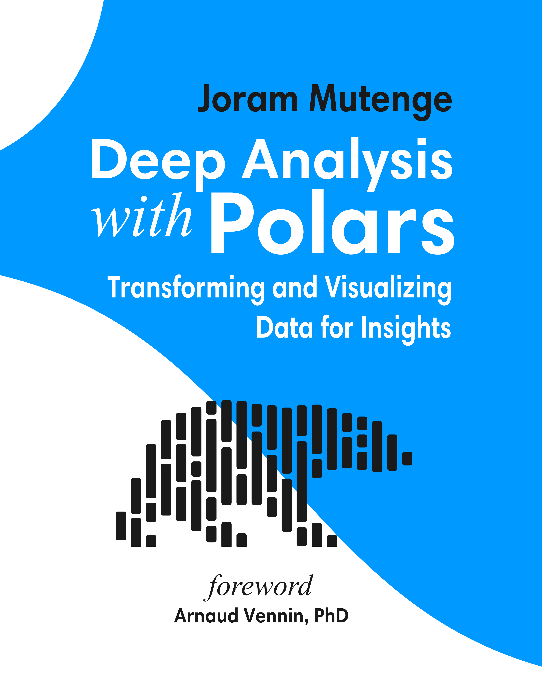
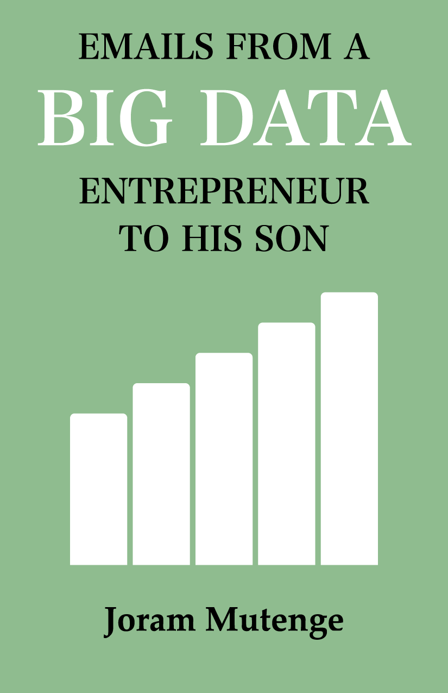

# Books

\$50

Deep Analysis with Polars

This book is **not** an introduction to Polars. It is intended to demonstrate to readers who are already familiar with Polars that the library is mature enough to support **deep analysis**, including the kind typically handled with complex SQL queries. By exploring practical analytical questions, the book emphasizes Polars core features such as expressions, lazy execution, efficient transformations, and its opinionated approach to writing code through method chaining.

[BUY](https://www.amazon.com/dp/B0GXG1BHG6/)

\$22

Emails from a Big Data Entrepreneur to His Son

This book is a modern-day reimagining of the timeless classic *Letters from a Self-Made Merchant to His Son* by George Horace Lorimer. With the same sharp wit, humor, and fatherly wisdom, this updated version brings the conversation into the digital age where data is the new oil and algorithms shape the future.

[BUY](https://www.amazon.com/dp/B0FHFWZFT9/)
