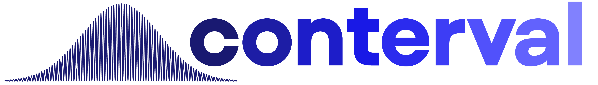

  
  
a data & AI consulting company

<!-- Services card -->

  <h2 style="text-align: center;">Our Services</h2>
  
**Data** Cleaning, Analysis, Visualization, Engineering

  
Dashboard Building, Report Automation

  
Extract Transform Load (ETL)

  
Analytics Engineering

  
AI implementation

<!-- Contact card -->

  <h2 style="text-align: center;">Contact Us</h2>
  

     <a href="mailto:contervalconsult@gmail.com" style="text-decoration: none; color: inherit;"><i class="fa-solid fa-envelope"></i></a>
  

